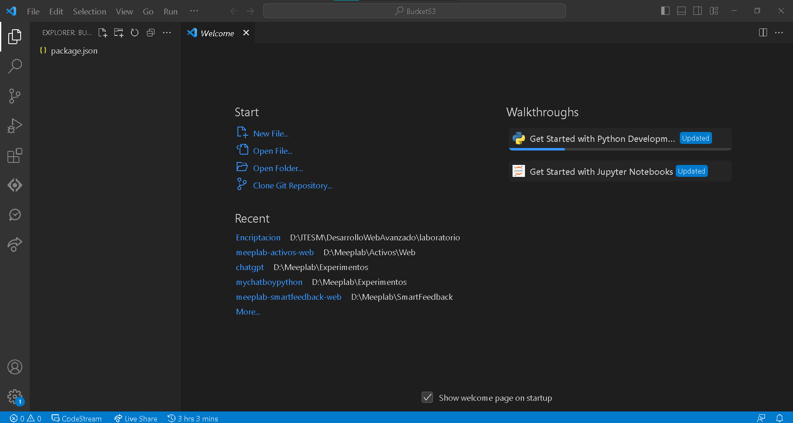

# Bucket S3

## Objetivo

En este laboratorio exploraremos el uso de la el servidor de archivos de AWS S3.

Este proceso que revisaremos en el laboratorio puede ser transferido a otros servidores de archivos la única diferencia será la herramienta a utilizar y los métodos pero la lógica es la misma.

## Instrucciones

Sigue los pasos descritos en la siguiente práctica, si tienes algún problema no olvides que tus profesores están para apoyarte.

## Laboratorio
### Paso 1 Configuración del Proyecto

Crea una carpeta en tu computadora donde vas a ejecutar el proyecto y ejecuta el comando.

```
npm init
```

Introduce los valores generales que necesites del proyecto para el archivo principal usaremos **index.js**.




Ahora vamos a instalar las librerías básicas que necesitamos para este proyecto.

```
npm i -s express
npm i -s aws-sdk
npm i -s multer
npm i -s multer-s3@2.10.0
```

### Paso 2 Creación de formulario de archivos
Una vez, que tenemos instaladas las librerías vamos a crear un archivo **index.html** y vamos a agregar el siguiente form.

```
<!DOCTYPE html>

<html lang="en">

    <head>

        <meta charset="UTF-8">

        <meta name="viewport" content="width=device-width, initial-scale=1.0">

        <title>Hello World Simple App</title>

    </head>

    <body>

        <div class="container">

            <h1>Multipart File Upload</h1>

            <form action="/upload_file" method="POST" id="form"  enctype="multipart/form-data">

                <div class="input-group">

                    <label for="files">Select files</label>

                    <input id="file" name="file" type="file" />

                </div>

                <button class="submit-btn" type="submit">Upload</button>

            </form>

        </div>

    </body>

</html>
```

Algunos puntos importantes a tomar en cuenta desde aquí son los siguientes:

Definir la ruta del form en este caso a

```
action = "/upload_file"
method = "POST"
enctype="multipart/form-data"

```

En el action vamos a definir la ruta que vamos a utilizar para subir nuestro archivo, en este caso será el  **/upload_file**.

También vamos a definir el action del envío de formulario como **POST**.

Por último necesitamos definir el formulario como multi parte esto para el envío de los archivos.

### Paso 3 Configuración del backend

Ahora vamos a regresar al **index.js** y vamos a copiar la siguiente configuración inicial.

```
const express = require('express');

const multer = require('multer');

var path = require('path');

const app = express();

const port = 5000;

const log = console.log

app.get('/', (req, res) => {        
    res.sendFile('index.html', {root: __dirname});
});

app.listen(port, () => {  
//server starts listening for any attempts from a client to connect at port: {port}
    console.log(`Now listening on port ${port}`);
});
```

Si ejecutamos el proyecto ya sea con **npm start** o **node index.js**, nos deberá aparecer lo siguiente.


### Paso 4 Preparación de la subida de archivos

Ya que tenemos nuestro form armado y corriendo vamos a regresar a nuestro proyecto y vamos a crear una carpeta **public**, aquí vamos a guardar los archivos que subamos en nuestro form.


Por último en nuestro archivo **index.js** antes de la declaración del servidor vamos a agregar la ruta para subir la imagen de la siguiente forma.

```
app.post('/upload_file', function(req, res) {
    log("Cargando el archivo")
    res.status(200).json({code: 200, msg:"Ok"})
});
```

Aquí recuerda que estamos definiendo el **POST** del formulario de **index.html** y también la ruta del action **/upload_file**.

Si cargamos un archivo y damos clic en **Upload** deberemos ver algo como lo siguiente.


Ya tenemos la ruta preparada, ahora vamos con lo que necesitamos para el laboratorio.

### Paso 5 Configuración de multer

En primer lugar vamos a cargar el archivo que agregemos a nuestro proyecto, puede que ya estés familiarizado con la librería de **multer**, en caso de que no, usaremos esta librería para tomar el **multipart** de nuestro formulario y recibir el archivo.

Para ello necesitamos configurar en donde se guardará el archivo y con que nombre. Esto lo haremos de forma muy lineal con la siguiente configuración.

```
var storage = multer.diskStorage({

    destination: function (req, file, callback) {

        callback(null, './public/');

    },

    filename: function (req, file, callback) {

        return callback(null,file.originalname);

    }

});
```

La siguiente definición carga la librería de **multer** y especifica que el destino del archivo sea la carpeta pública que definimos hace unos pasos. Y para el archivo no haremos ningún cambio significativo, pasaremos el nombre que recibimos desde el inicio.

Ahora dentro de nuestra ruta de **/upload_file** vamos a sustituir el

```
res.status(200).json({code: 200, msg:"Ok"})
```

Por lo siguiente:

```
var upload = multer({ storage : storage }).array('file',1);

upload(req,res,function(err) {

	//log(req.body);

	//log(req.files);

	if(err) {

		log(err)

		return res.end("Error uploading file.");

	}


	var pathDest = req.files[0].destination.slice(1)

	var finalPath = path.join(__dirname, '../../'+pathDest)

	log(finalPath)

	res.status(200).json({code: 200, msg:"Ok"})  

})
```

La línea más importante de todo este código es la siguiente:

```
var upload = multer({ storage : storage }).array('file',1);
```

Aquí no solo llamamos a nuestra configuración de **multer**, sino que vamos a recibir un arreglo de archivos que vienen de el **index.html** y el string **'file'** es el id que otorgamos en el formulario al **input** en su propiedad de **name** recuerda siempre esto ya que el primer error que se comete al estar aprendiendo en los formularios es definir estos ids.

Para nuestro caso solo vamos a subir un archivo pero **multer** nos permite agregar múltiples archivos desde la propiedad del file a partir de nuestro form. Te dejo esta configuración en caso de que en otros proyectos quieras trabajar con múltiples archivos, funciona prácticamente igual.

```
var pathDest = req.files[0].destination.slice(1)
```

En esta línea puedes ver como funciona el arreglo puesto que al llamar **req.files[0]** lo que estamos haciendo es llamar al archivo según hayamos subido y aunque sea 1 sabemos que el primero será el de la posición 0.

Nuevamente vamos a ejecutar nuestro servidor y si volvemos a probar el resultado será el mismo pero dentro de nuestro proyecto pasará lo siguiente.


Como puedes observar el archivo que hayamos puesto se ha subido correctamente a nuestra carpeta pública.

Como no hemos puesto ninguna limitación en cuestión de archivos realmente podemos subir lo que sea pero para efectos prácticos y que te quede más claro te recomiendo comiences con una imagen sea **.jpg** o **.png**.

### Paso 6 Consulta de archivos públicos

El siguiente paso quizás sea un poco obvio pero es el punto de partida para lograr identificar las variaciones con las que estaremos trabajando en el laboratorio.

De momento tenemos cargada la **imagen_prueba.png** o en tu caso el archivo que hayas subido.

Teniendo activo nuestro servidor ¿Cómo podemos ver este archivo?. Siempre es importante que tengas visibilidad en como acceder un archivo particular.

Para esto debemos considerar donde se encuentra guardado nuestro archivo y para ello olvida las rutas absolutas del sistema en donde este alojado el archivo puesto que estas rutas no son con las que trabajamos en el proyecto.

Las rutas que utilizamos son las rutas relativas y estas se construyen a través de las URL que vamos generando. Por default la carpeta **public** expone los archivos dentro de esta carpeta y por lo general son imágenes genéricas, templates de html, css, archivos js entre otros.

Si quiero acceder a un archivo dentro de esta carpeta basta con que agregue **{{dominio}}/{{ruta_desde_public}}

Pero antes de hacer esto debemos configurar la carpeta **public** como la que accede a los archivos estáticos del proyecto, para ello en el **index.js** vamos a agregar la siguiente línea antes de la definición de la URL **/**.

```
app.use(express.static(path.join(__dirname, 'public')));
```

Una vez configurado si quisiera recuperar mi imagen entonces la ruta que necesitamos acceder es:

```
http://localhost:5000/imagen_prueba.png
```

En mi caso el resultado en el navegador es el siguiente:


### Paso 7 Consulta de archivos privados

En el paso anterior manejamos los archivos estáticos, pero cuando trabajamos con subida de archivos lo ideal es que estos archivos no queden expuestos, y regresamos a lo mismo, todo en la carpeta **public** queda expuesto.

Otro riesgo que corremos al colocar todo en **public** es que si trabajamos con un repositorio este comenzará a crecer y podemos enfrentarnos a alcanzar el límite de tamaño del repositorio que normalmente va al rededor de los 2GB.

Lo ideal en estos casos es que vayamos creando una carpeta fuera del repositorio y desde ahí manejarlo.

Para el laboratorio simplemente lo haremos fuera de la carpeta **public** pero lo haremos dentro del proyecto.

**Nota: Recuerda tener siempre en cuenta el uso de los archivos en general, cada caso es diferente y debes estar preparado para el escenario correspondiente.**

Para comenzar vamos a expandir nuestro **index.html** con un nuevo formulario debajo del que ya tenemos.

```
<div class="container">

	<h1>Multipart File Private Upload</h1>

	<form action="/upload_file_private" method="POST" id="form"  enctype="multipart/form-data">

		<div class="input-group">

			<label for="files">Select files</label>

			<input id="file" name="file" type="file" multiple />

		</div>

		<button class="submit-btn" type="submit">Upload</button>

	</form>

</div>
```

Ahora vamos a añadir una nueva ruta de **POST** en el **index.js**

```
app.post('/upload_file_private', function(req, res) {
    log("Cargando el archivo")
    res.status(200).json({code: 200, msg:"Ok"})
});
```

Nuevamente ejecutamos el servidor y debemos ver algo como lo siguiente con el nuevo formulario.


Ahora vamos a crear una nueva carpeta en el proyecto llamada **private** y teniendo lo siguiente.


El siguiente paso será crear una nueva configuración de multer para subir nuestros nuevos archivos a esta carpeta.

```
var storage2 = multer.diskStorage({
    destination: function (req, file, callback) {
        callback(null, './private/');
    },

    filename: function (req, file, callback) {
        return callback(null,file.originalname);
    }
});
```

**Nota: Esta es una configuración adicional a la que ya tenemos, la anterior no la vayas a eliminar**

Por último sustituimos el 

```
res.status(200).json({code: 200, msg:"Ok"})
```

Por el código de subida de la información

```
var upload = multer({ storage : storage2 }).array('file',1);
upload(req,res,function(err) {
	//log(req.body);
	//log(req.files);
	
	if(err) {
		log(err)
		return res.end("Error uploading file.");
	}

	var pathDest = req.files[0].destination.slice(1)
	var finalPath = path.join(__dirname, '../../'+pathDest)
	log(finalPath)
	res.status(200).json({code: 200, msg:"Ok"})  
})
```


Con el resultado anterior observamos que la misma imagen queda arriba dentro de nuestra carpeta privada. Pero para acceder a ella es donde tenemos que empezar a localizar lo que pasa en nuestra aplicación.

Con lo que vimos de la carpeta **public** podemos acceder a este archivo pero la incógnita que nos queda es si hacer este proceso de la carpeta **private** es lo que necesito para proteger mis archivos, ¿Cómo doy acceso a ellos cuando se necesiten?

Para esto es que no podemos dar acceso público, pero podemos dar un acceso a través de una URL.

Este es el proceso de control ya que al dar acceso mediante URL podemos agregar tanto procesamiento adicional al archivo en caso de ser necesario o en su defecto protegerlo con el sistema de autenticación que definamos para el **API**.

```
app.get('/get_private_file/:file', function(req, res) {
    var fileName = req.params.file
    res.sendFile(path.join(__dirname, './private', fileName));
});
```

Con el uso del método de express **res.sendFile** podemos interpretar un archivo y cargarlo del lado del cliente.

Este último paso es bastante sencillo en términos de solo realizar la canalización del archivo a la carpeta **private** pero tomando en cuenta que esto nos da control de acceso y de procesamiento en el proceso de consultar archivos que no están directamente abiertos al público nos permite hacer muchas cosas a largo plazo.

### Paso 8 Configuración Bucket S3 AWS

Ya hemos visto sobre el manejo de archivos de manera local, esto es, desde nuestro proyecto de la aplicación. Si bien este formato es funcional y muchos sistemas se apoyan de ello, es importante mencionar que tiene varios riesgos importantes, como por ejemplo:

¿Qué pasa si se hackea o se destruye el servidor? - Se pierden los archivos si no se tiene redundancia o una copia
¿Cuánto cuesta hacer una copia de seguridad de todo si el código ya esta respaldado en su propio repositorio? - Podemos crear un servidor con el repositorio, pero si se pierden los archivos tenemos un problema si no hay un respaldo

Estos son algunos de los casos más visibles de los problemas que tenemos, además de situaciones de seguridad en cuestiones de encriptación y acceso de estos mismos archivos.

Una buena arquitectura de servidor hoy en día utiliza servidores separados para las capas que maneja, dando:

- El servidor de la aplicación (repositorio)
- El servidor de base de datos
- El servidor de archivos

Teniendo esta separación nos ayuda a definir a quien debemos dar más importancia y mejores políticas de seguridad.

Por ejemplo el servidor de base de datos quizás sea el más importante por lo que lo ideal sería agregarle redundancia, respaldos, monitoreo continuo de recursos, etc.

Para el servidor de archivos podemos crear un servidor igual al de la aplicación, pero por el tipo de movimiento y datos que se guardan perderíamos muchos recursos usando un servidor normal.

Las plataformas en la nube como AWS, GCP, Azure como las más conocidas pero cualquier servicio de servidores en la nube deben tener una opción de servidor de archivos. Normalmente estos servidores son optimizados para solo guardar archivos y los recursos de procesamiento no son tan grandes pues solo se encargan en servir y almacenar la información.

Para el caso de Amazon con AWS, la opción que tenemos es un llamado bucket que de forma coloquial conocemos como S3 cuyo nombre real es Simple Cloud Storage.

Lo que mencionaba al inicio de este laboratorio es que vamos a hacer la implementación directa con el S3, pero fuera de los métodos del sdk la idea es la misma para cualquier servicio de almacenamiento, entonces si quieres cambiar a otro servicio solo necesitarás modificar los métodos pero la lógica es más o menos la misma.

Para poder avanzar vamos a asumir que contamos con acceso a una cuenta de AWS y que ya tenemos adquirido un servicio de S3.

Entrando a la consola de administración de AWS, vamos a tener nuestros servicios. Ya sea desde el panel de acceso rápido o desde la búsqueda escribimos S3.


**Nota: Si creas un bucket por primera vez es suficiente con ponerle el nombre, toda la demás configuración puede quedarse como viene por default**

Al momento de trabajar con buckets, debemos tomar en consideración 3 variables importantes que son las que nos permitirán conectarnos desde nuestra aplicación.

```
"AWS_BUCKET":"nombre_del_bucket",
"AWS_ACCESS_KEY_ID":"id_cuenta_amazon",        "AWS_SECRET_ACCESS_KEY":"pass_cuenta_amazon"
```

El nombre del bucket literamente el nombre desplegado dentro del panel del S3 y es con el cual nombramos nuestro bucket, en el ejemplo de mis buckets uno por ejemplo sería el de **meeplab-smartfeedback**.

Para obtener las siguientes 2 es necesario crear un par de clave y llave secreta, estos no son directos del S3, son más bien un par de claves de API para nuestra cuenta de Amazon.

Para generarlo vamos a abrir la opción de credenciales de seguridad que se encuentra en la parte superior derecha del panel de AWS.


Una vez en esta vista vamos a bajar a la opción de **Claves de Acceso**


Una vez aquí daremos clic en **Crear clave de acceso** y nos deberá generar tanto el id como la contraseña.

**Nota: Guarda bien la contraseña pues no se puede acceder a esta después**

Una vez teniendo las 3 variables vamos a contenerlas en nuestro proyecto, pero empecemos con la configuración desde nuestra aplicación.

### Paso 9 Configuración de Aplicación

Para seguir el orden que tenemos vamos a crear un nuevo formulario dentro de nuestro archivo **index.html**

```
<div class="container">
	<h1>Multipart File S3 SDK Upload</h1>

	<form action="/upload_file_s3_sdk" method="POST" id="form"  enctype="multipart/form-data">
		<div class="input-group">
			<label for="files">Select files</label>
			<input id="file" name="file" type="file" multiple />
		</div>

		<button class="submit-btn" type="submit">Upload</button>
	</form>
</div>
```

El resultado deberá observarse como lo siguiente


Nuevamente agregamos la nueva ruta a nuestro archivo **index.js**

```
app.post('/upload_file_s3_sdk', function(req, res) {
    log("Cargando el archivo")
    res.status(200).json({code: 200, msg:"Ok"})
});
```

Probamos que la base funcione correctamente primero.


Ya que funciona nuestra URL, ahora vamos a crear una nueva carpeta, esta vez la llamaremos **bucket**, esta carpeta funcionará de transición para subir el archivo, después mandarlo al bucket y finalmente destruir el archivo dentro de nuestra carpeta.

Este proceso nos servirá para poder trabajar de manera intermedia con el archivo para hacerle modificaciones como por ejemplo encriptarlo y almacenarlo en el bucket.


Ahora vamos a crear una nueva configuración de multer que suba a nuestra nueva carpeta **bucket**.

```
var storage3 = multer.diskStorage({
    destination: function (req, file, callback) {
        callback(null, './bucket/');
    },
  
    filename: function (req, file, callback) {
        return callback(null,file.originalname);
    }
});
```

Y al igual que en los pasos anteriores vamos a sustituir en la ruta de **/upload_file_s3_sdk** la línea de

```
res.status(200).json({code: 200, msg:"Ok"})
```

Por lo siguiente

```
var upload = multer({ storage : storage3 }).array('file',1);
upload(req,res,function(err) {
	//log(req.body);
	//log(req.files);

	if(err) {
		log(err)
		return res.end("Error uploading file.");
	}

	var pathDest = req.files[0].destination.slice(1)
	var finalPath = path.join(__dirname, '../../'+pathDest)
	log(finalPath)
	res.status(200).json({code: 200, msg:"Ok"})  
})
```

Hasta este punto todo es igual a los pasos anteriores, si ejecutamos y probamos debemos poder ver el archivo en la nueva carpeta **bucket** 


Ahora antes de trabajar con el bucket, vamos a completar el proceso que debe seguir el archivo de manera local en nuestra aplicación, esto es que una vez que se termina todo el proceso se debe eliminar la imagen y nuestra carpeta **bucket** debe quedar vacía.

Esto lo vamos a lograr usando la librería fs o el filesystem de node. 

Dentro de **index.js** en la parte superior de los imports vamos a agregar la librería, como esta es parte de node no necesitamos instalar nada.

```
const fs = require('fs');
```

Para modificar el código lo haremos sustituyendo nuevamente la llamada en **/upload_file_s3_sdk** donde tenemos la siguiente línea

```
res.status(200).json({code: 200, msg:"Ok"})
```

Y vamos a agregar lo siguiente

```
log(path.join(__dirname, './bucket', req.files[0].filename))

fs.unlink(path.join(__dirname, './bucket', req.files[0].filename), (err) => {
	if (err) {
		console.error(err)
		res.status(200).json({code: 200, msg:"Ok"})
	}

	res.status(200).json({code: 200, msg:"Ok"})
})
```

Este paso elimina el archivo de **bucket** y finaliza con la respuesta del servidor, sin importar que exista error o no el borrado regresamos un success, pero recuerda que en tus aplicaciones debes manejar correctamente los errores.

Si nuevamente ejecutamos el proceso veremos que ahora siempre que subamos un archivo al formulario del S3 bucket la carpeta queda vacía.


Ahora ya que manejamos el proceso de nuestra aplicación vamos a proceder a subir el archivo al bucket.

Esta primera forma que vamos a manejar podemos decir que es la oficial de amazon para el manejo del bucket, puesto que usa el sdk oficial para hacer la subida de la información, para esto deberemos configurar en el proyecto lo siguiente.

En el archivo **index.js** en el apartado de los imports vamos a añadir nuestras librerías

```
const AWS_BUCKET            = ""
const AWS_ACCESS_KEY_ID     = ""
const AWS_SECRET_ACCESS_KEY = ""
const AWS                   = require('aws-sdk');

AWS.config.update({
  signatureVersion: 'v4',
  accessKeyId: AWS_ACCESS_KEY_ID,
  secretAccessKey: AWS_SECRET_ACCESS_KEY
});

const s3 = new AWS.S3();
```

Aquí es donde usaremos las 3 variables que mencionamos anteriormente para trabajar con el bucket, **no olvides sustituirlas por los valores correspondientes**.

Una vez configurado el sdk, vamos a regresar a **/upload_file_s3_sdk**, y justo antes del borrado vamos a agregar el procesamiento del archivo.

Un problema al trabajar con el bucket es que no podemos pasar el archivo así nada más, necesitamos convertirlo a base64 para poder subirlo. Para poder hacer esto nuevamente vamos a utilizar **fs** para procesar el archivo, entonces el código para hacerlo es el siguiente

```
fs.readFile(path.join(__dirname, './bucket', req.files[0].filename), (err, data) => {

	if (err) throw err;
		var base64data = new Buffer(data, 'binary');
		const params = {
			Bucket: AWS_BUCKET,
			Key: req.files[0].filename,
			Body: base64data
	};
})
```

Para explicar un poco este paso, estamos leyendo el archivo con **fs** y el resultado lo estamos pasando a un buffer de datos binarios que servirá como nuestra base64.

Finalmente creamos los parámetros que enviaremos al bucket, más o menos como nuestro paquete donde necesitamos

````
Bucket: //El nombre del Bucket,
Key: //La llave es el nombre del archivo,
Body: //Nuestro buffer en base64

````

**Nota: La llave si bien es el nombre del archivo puede especificarse como ruta, esto crea de manera automática en el bucket las carpetas correspondientes en caso de que no existan**

El último paso entonces es subir al bucket y esto lo haremos con la llamada al sdk

```
s3.upload(params, function(s3Err, data) {
	if (s3Err) throw s3Err

	console.log(`File uploaded successfully at ${data.Location}`)
})
```

La llamada al sdk hace uso del método **upload** en donde se recibe el paquete de **params** y en automático si todo está bien configurado debería de funcionar.

El código final para **/upload_file_s3_sdk** quedaría como

```
app.post('/upload_file_s3_sdk', function(req, res) {
    log("Cargando el archivo")
    var upload = multer({ storage : storage3 }).array('file',1);
    upload(req,res,function(err) {
        //log(req.body);
        //log(req.files);

        if(err) {
            log(err)
            return res.end("Error uploading file.");
        }

        var pathDest = req.files[0].destination.slice(1)
        var finalPath = path.join(__dirname, '../../'+pathDest)
        //log(path.join(__dirname, './bucket', req.files[0].filename))
        fs.readFile(path.join(__dirname, './bucket', req.files[0].filename), (err, data) => {

            if (err) throw err;
            var base64data = new Buffer(data, 'binary');
            const params = {
                Bucket: AWS_BUCKET,
                Key: req.files[0].filename,
                Body: base64data
            };

            s3.upload(params, function(s3Err, data) {
                if (s3Err) throw s3Err
                console.log(`File uploaded successfully at ${data.Location}`)

                fs.unlink(path.join(__dirname, './bucket', req.files[0].filename), (err) => {

                    if (err) {
                        console.error(err)
                        res.status(200).json({code: 200, msg:"Ok"})
                    }
                    res.status(200).json({code: 200, msg:"Ok"})
                })
            })
        })
    })
});
```

Si ejecutamos la aplicación vamos a tener del lado del navegador


Lo que no es nada nuevo pero nos corrobora que del lado de la aplicación todo esta correcto.

Y ahora lo más importante vamos a validar que en el bucket se haya guardado la imagen. Vamos a acceder a nuestro bucket en la aws console y debemos ver algo como lo siguiente.


Algo que no mencioné antes es que puede ser tentador utilizar el bucket para acceder a la ruta de archivos, pero por seguridad y en la configuración default amazon no nos permite esto. Si quisiéramos ver el archivo desde el link generado por amazon necesitamos actualizar las políticas de seguridad del bucket lo cual según la documentación es riesgoso, puesto que estamos pensando que el servidor no debe ser accedido desde fuera y no por nadie más que nuestro servidor de la aplicación.

**Nota: Puedes configurar el bucket para servir archivos estáticos e incluso subir páginas web pequeñas o hacer despliegues más combinados  como por ejemplo en el uso de beanstalk pero ya esto queda fuera del alcance del laboratorio actual y es para un uso más avanzado del bucket.**

### Paso 10 Recuperar archivo del bucket

Ya hemos subido nuestro archivo al bucket pero ahora ¿Qué tenemos que hacer para recuperarlo?. Vamos a crear una nueva URL llamada **/get_bucket_file** que recibirá como parámetro el nombre del archivo, el contenido es llamar al sdk y ejecutar el método **getObject** que nos devolverá un stream de datos y esos los podremos pasar a la petición.

El código sería el siguiente

```
app.get('/get_bucket_file/:file', function(req, res) {
    var filename = req.params.file
    console.log('Trying to download file: ' + filename)
    var opciones = {
        Bucket: AWS_BUCKET,
        Key: filename,
    }

    s3.getObject(opciones, function(err, data) {
        res.attachment(filename)
        res.send(data.Body)
    })
});
```

Para hacer una prueba introduce la URL sustituyendo el nombre por el de tu archivo, en mi caso:

```
http://localhost:5000/get_bucket_file/imagen_prueba.png
```

Observa que a diferencia del **res.sendFile** aquí usamos directamenre el **res.send** esto es por como Amazon nos devuelve la información, la única diferencia es que en el navegador con **sendFile** se visualiza desde el mismo pero con **send** se descarga el archivo, con eso en mente ya tienes opciones para manejar diferentes formas de manejar el resultado de archivos, ambas son buenas y totalmente válidas.

Ahora bien, si pensamos en un caso de uso como la imagen de perfil de un usuario y esta la cargamos desde código html aunque usemos **/get_bucket_file** añadiendo la ruta en el **src** de la etiqueta de **img** no hay ningún problema ya que no significa que se descargue el archivo, de manera automática el navegador desplegará la imagen correspondiente.

### Paso 11 Subida directa al bucket

Hasta este punto ya tenemos 3 formas de manejar archivos en nuestra aplicación:

1. Subir a la carpeta **public
2. Guardar en una carpeta protegida privada
3. Subir al bucket de S3 haciendo pre procesamiento

Normalmente estas serían todas las formas posibles, pero que tal que nos hacemos la vida un poco más fácil en el caso de que queramos subir archivos al bucket pero no queremos hacer todo el pre procesamiento.

Esto impacta al proceso de subir a la carpeta **bucket** crear el base64 y después borrar el archivo temporal.

Para esto usaremos la librería multer-s3 que de manera directa subirá al bucket la información.

Antes que nada vamos a crear un último form en **index.html**

```
<div class="container">
	<h1>Multipart File S3 Multer Upload</h1>
	<form action="/upload_file_s3_multer" method="POST" id="form"  enctype="multipart/form-data">
		<div class="input-group">
			<label for="files">Select files</label>
			<input id="file" name="file" type="file" multiple />
		</div>

		<button class="submit-btn" type="submit">Upload</button>
	</form>
</div>
```


Creamos nuestra URL básica como en pasos anteriores en el **index.js**

```
app.post('/upload_file_s3_multer', function(req, res) {
    log("Cargando el archivo")
    res.status(200).json({code: 200, msg:"Ok"})
});
```

No olvides probar hasta este punto para verificar que no hay problemas con la ruta.

Ahora dentro de los imports vamos a agregar la librería que nos hace falta

```
var multerS3 = require('multer-s3')
```

Las siguientes configuraciones son parecidas a las primeras que hicimos para **public** y para **private**, sin embargo contienen unas ligeras diferencias, cuando termines el laboratorio revisa el código para que veas en que son diferentes.

En primer lugar crearemos una nueva configuración de multer

```
var storage4 = multer({

    storage: multerS3({
        s3: s3,
        bucket: AWS_BUCKET,
        metadata: function (req, file, cb) {
            cb(null, {fieldName: file.fieldname});
        },

        key: function (req, file, cb) {
            log(file)
            return cb(null, file.originalname);
        }
    })
})
```

Esta configuración recibe nuestros parámetros del bucket y también aquí podemos decidir si mantenemos el nombre original del archivo o lo modificamos, para nuestro caso lo mantendremos tal cual.

Ahora dentro de nuestra URL **/upload_file_s3_multer** nuevamente sustituimos

```
res.status(200).json({code: 200, msg:"Ok"})
```

Por lo siguiente

```
log("Cargando el archivo")

var upload = storage4.array('file',1);
log("PREVIO")

upload(req,res,function(err) {
	//log(req.body);
	//log(req.files);

	if(err) {
		log(err)
		return res.end("Error uploading file.");
	}

	res.status(200).json({code: 200, msg:"Ok"})
})
```

Este paso es igual que en los anteriores pero la diferencia está aquí

```
var upload = storage4.array('file',1);
```

Compara como se llama en **public** y en **private**.

Nuevamente vamos a probar la funcionalidad 


Subí otro archivo para distinguir las rutas.

### Paso 12 Últimos detalles

Con esto ya tenemos listo todas las formas posibles de manejar los archivos, vamos a añadir algunos extras al **index.html** para que observes en acción el uso de cada llamada a los archivos.

**Nota: No te olvides de sustituir el nombre del archivo en caso de que hayas utilizado alguno otro, en caso que haya utilizado algo diferente a imagen, entonces sustituye el image por una < a href>.

```
<div class="container">
	<h1>Public File</h1>
	</img>
	<h1>Private File</h1>
	</img>
	<h1>Bucket File</h1>
	</img>
</div>
```

**Reto adicional: Ya vimos como hacer todo el proceso de subida y consulta de archivo, ahora intenta por tu cuenta hacer el eliminado del bucket y ver que pasa cuando subes un archivo con el mismo nombre, así como intenta actualizar un archivo sobre ese mismo caso.**