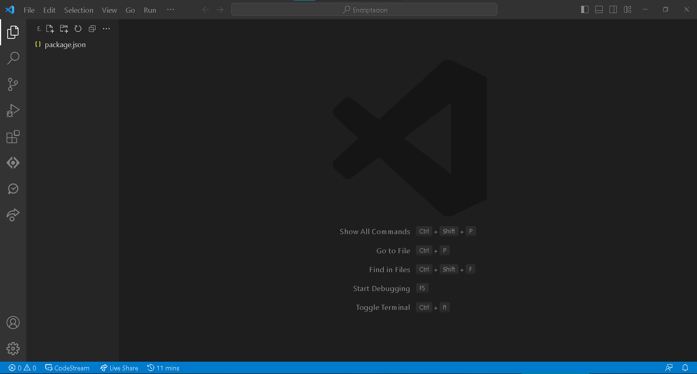
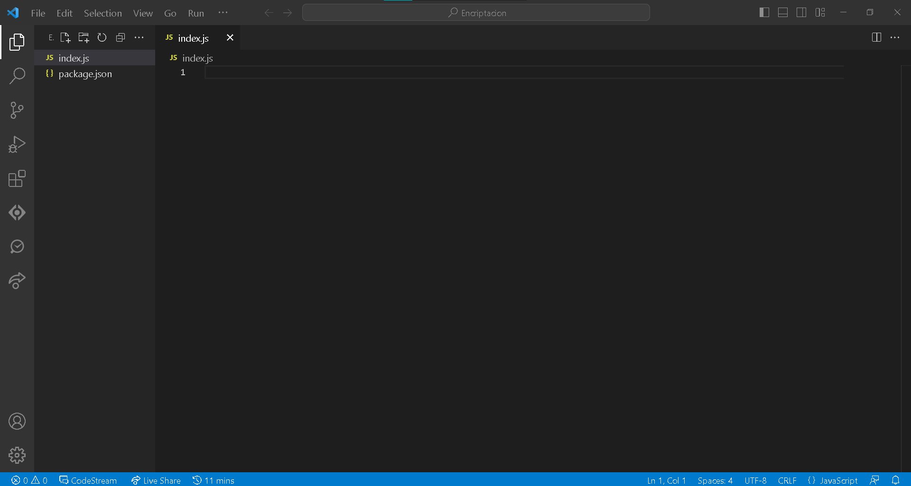
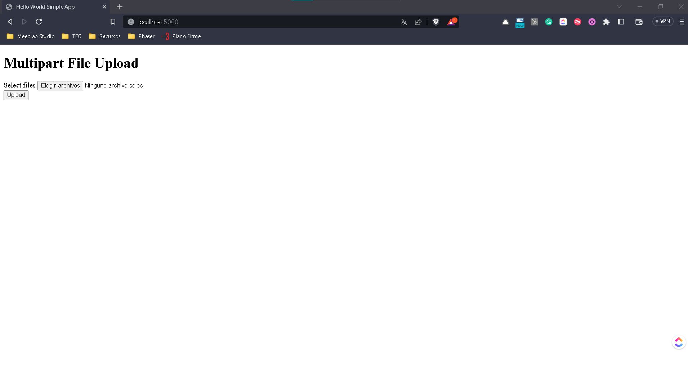
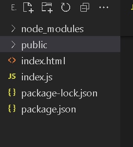
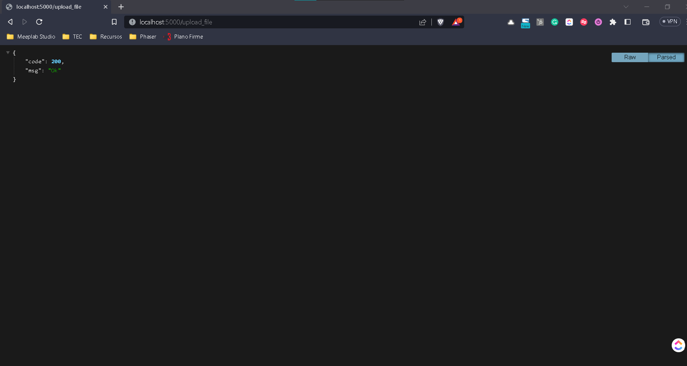
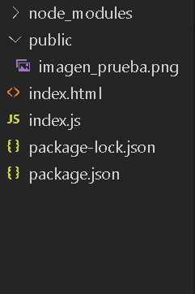
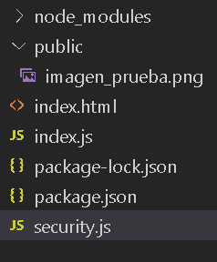
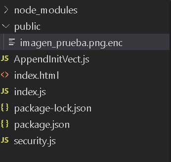
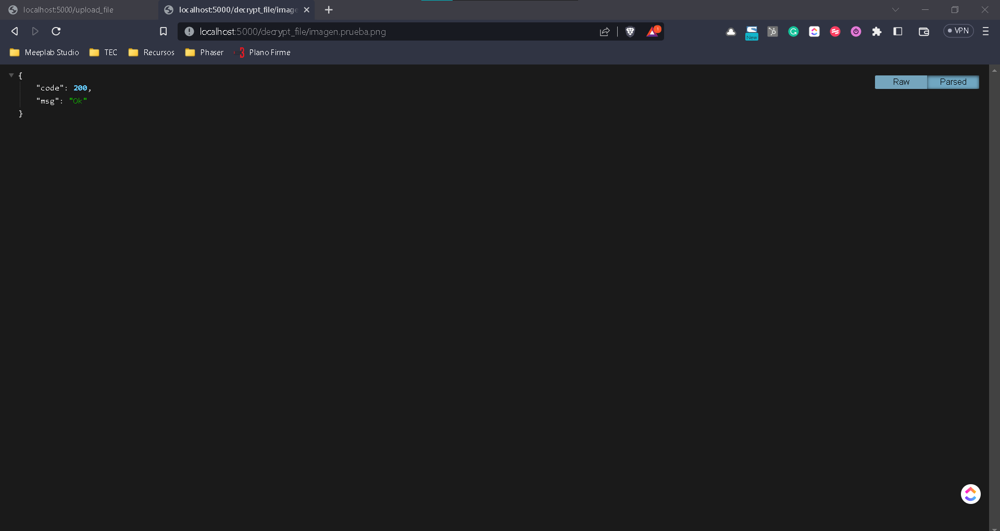
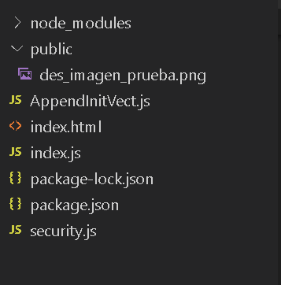

# Encriptación con Crypto.js

## Objetivo

En este laboratorio exploraremos el uso de la encriptación utilizando el estándar AES256 para archivos.

AES es un algoritmo de cifrado por bloques que funge como el estándar actual de la industria así como de muchos de los departamentos gubernamentales de Estados Unidos.

Para este laboratorio se requiere que ya tengas conocimiento sobre NodeJS, Express y manejo de forms en html para envío del formulario POST, GET.

## Instrucciones

Sigue los pasos descritos en la siguiente práctica, si tienes algún problema no olvides que tus profesores están para apoyarte.

## Laboratorio
### Paso 1 Configuración del Proyecto

Crea una carpeta en tu computadora donde vas a ejecutar el proyecto y ejecuta el comando.

```
npm init
```

Introduce los valores generales que necesites del proyecto para el archivo principal usaremos **index.js**.





Ahora vamos a instalar las librerías básicas que necesitamos para este proyecto.

```
npm i -s crypto
npm i -s express
npm i -s multer
npm i -s promise
npm i -s zlib
```

### Paso 2 Creación de formulario de archivos
Una vez, que tenemos instaladas las librerías vamos a crear un archivo **index.html** y vamos a agregar el siguiente form.

```
<!DOCTYPE html>

<html lang="en">

    <head>

        <meta charset="UTF-8">

        <meta name="viewport" content="width=device-width, initial-scale=1.0">

        <title>Hello World Simple App</title>

    </head>

    <body>

        <div class="container">

            <h1>Multipart File Upload</h1>

            <form action="/upload_file" method="POST" id="form"  enctype="multipart/form-data">

                <div class="input-group">

                    <label for="files">Select files</label>

                    <input id="file" name="file" type="file" multiple />

                </div>

                <button class="submit-btn" type="submit">Upload</button>

            </form>

        </div>

        <script src="index.js"></script>

    </body>

</html>
```

Algunos puntos importantes a tomar en cuenta desde aquí son los siguientes:

Definir la ruta del form en este caso a

```
action = "/upload_file"
method = "POST"
enctype="multipart/form-data"

```

En el action vamos a definir la ruta que vamos a utilizar para subir nuestro archivo, en este caso será el  **/upload_file**.

También vamos a definir el action del envío de formulario como **POST**.

Por último necesitamos definir el formulario como multi parte esto para el envío de los archivos.

### Paso 3 Configuración del backend

Ahora vamos a regresar al **index.js** y vamos a copiar la siguiente configuración inicial.

```
const express = require('express');

const multer = require('multer');

var path = require('path');

const app = express();

const port = 5000;

const log = console.log

  

app.get('/', (req, res) => {        

    res.sendFile('index.html', {root: __dirname});

});

app.listen(port, () => {            //server starts listening for any attempts from a client to connect at port: {port}

    console.log(`Now listening on port ${port}`);

});
```

Si ejecutamos el proyecto ya sea con **npm start** o **node index.js**, nos deberá aparecer lo siguiente.



### Paso 4 Preparación de la subida de archivos

Ya que tenemos nuestro form armado y corriendo vamos a regresar a nuestro proyecto y vamos a crear una carpeta **public**, aquí vamos a guardar los archivos que subamos en nuestro form.



Por último en nuestro archivo **index.js** antes de la declaración del servidor vamos a agregar la ruta para subir la imagen de la siguiente forma.

```
app.post('/upload_file', function(req, res) {
    log("Cargando el archivo")
    res.status(200).json({code: 200, msg:"Ok"})
});
```

Aquí recuerda que estamos definiendo el **POST** del formulario de **index.html** y también la ruta del action **/upload_file**.

Si cargamos un archivo y damos clic en **Upload** deberemos ver algo como lo siguiente.



Ya tenemos la ruta preparada, ahora vamos con lo que necesitamos para el laboratorio.

### Paso 5 Configuración de multer

En primer lugar vamos a cargar el archivo que agregemos a nuestro proyecto, puede que ya estés familiarizado con la librería de **multer**, en caso de que no, usaremos esta librería para tomar el **multipart** de nuestro formulario y recibir el archivo.

Para ello necesitamos configurar en donde se guardará el archivo y con que nombre. Esto lo haremos de forma muy lineal con la siguiente configuración.

```
var storage = multer.diskStorage({

    destination: function (req, file, callback) {

        callback(null, './public/');

    },

    filename: function (req, file, callback) {

        return callback(null,file.originalname);

    }

});
```

La siguiente definición carga la librería de **multer** y especifica que el destino del archivo sea la carpeta pública que definimos hace unos pasos. Y para el archivo no haremos ningún cambio significativo, pasaremos el nombre que recibimos desde el inicio.

Ahora dentro de nuestra ruta de **/upload_file** vamos a sustituir el

```
res.status(200).json({code: 200, msg:"Ok"})
```

Por lo siguiente:

```
var upload = multer({ storage : storage }).array('file',1);

upload(req,res,function(err) {

	//log(req.body);

	//log(req.files);

	if(err) {

		log(err)

		return res.end("Error uploading file.");

	}


	var pathDest = req.files[0].destination.slice(1)

	var finalPath = path.join(__dirname, '../../'+pathDest)

	log(finalPath)

	res.status(200).json({code: 200, msg:"Ok"})  

})
```

La línea más importante de todo este código es la siguiente:

```
var upload = multer({ storage : storage }).array('file',1);
```

Aquí no solo llamamos a nuestra configuración de **multer**, sino que vamos a recibir un arreglo de archivos que vienen de el **index.html** y el string **'file'** es el id que otorgamos en el formulario al **input** en su propiedad de **name** recuerda siempre esto ya que el primer error que se comete al estar aprendiendo en los formularios es definir estos ids.

Para nuestro caso solo vamos a subir un archivo pero **multer** nos permite agregar múltiples archivos desde la propiedad del file a partir de nuestro form. Te dejo esta configuración en caso de que en otros proyectos quieras trabajar con múltiples archivos, funciona prácticamente igual.

```
var pathDest = req.files[0].destination.slice(1)
```

En esta línea puedes ver como funciona el arreglo puesto que al llamar **req.files[0]** lo que estamos haciendo es llamar al archivo según hayamos subido y aunque sea 1 sabemos que el primero será el de la posición 0.

Nuevamente vamos a ejecutar nuestro servidor y si volvemos a probar el resultado será el mismo pero dentro de nuestro proyecto pasará lo siguiente.



Como puedes observar el archivo que hayamos puesto se ha subido correctamente a nuestra carpeta pública.

Como no hemos puesto ninguna limitación en cuestión de archivos realmente podemos subir lo que sea pero para efectos prácticos y que te quede más claro te recomiendo comiences con una imagen sea **.jpg** o **.png**.

### Paso 6 Preparación de un archivo de Seguridad

El proceso de encriptación de archivos comienza desde aquí, todo lo anterior es solo la base para poder trabajar con nuestro objetivo final que es la encriptación de los archivos.

Lo primero que haremos es agregar las siguientes líneas nuevamente en sustitución de:

```
res.status(200).json({code: 200, msg:"Ok"})
```

```
var original = "SECRET_KEY_USERS"
    Security.encryptFile("./public/",req.files[0].filename,original).then(function(results){

      log(req.files[0])

      res.status(200).json({code: 200, msg:"Ok"})

})
```

La primera línea es la llave de encriptación que usará nuestro algoritmo. Aquí te estoy dejando una visibilidad muy simple, pero recuerda: **la seguridad empieza protegiendo la llave**, esta llave secreta debería estar en un archivo aparte e incluso con su propia encriptación para evitar cualquier filtración.

Después hacemos la llamada al archivo de **Security** que aún no definimos, este archivo nos permitirá definir la encriptación del archivo y recibe 3 parámetros, la carpeta contendora del archivo, el nombre del archivo y la llave de encriptación.

Como la encriptación puede tomar un poco de tiempo se debe definir como asíncrono, dentro del archivo de **Security** usaremos **Promises** para cargar la información.

Ahora vamos a crear un nuevo archivo que se llame **security.js**



Ahora vamos a cargar en este nuevo archivo las librerías que necesitamos

```
var path       = require('path');
var fs         = require('fs');
var Promise    = require('promise');
var zlib       = require('zlib');
var crypto     = require('crypto');
var AppendInitVect    = require('./AppendInitVect');

var log        = console.log
```

Todas las librerías las tenemos excepto el **AppendInitVect**, este archivo nos permite generar un vector inicial que es usado en los cifrados de encriptación por bloques.

Antes de avanzar vamos a trabajar con este vector inicial creando el archivo **AppendInitVect.js**

El contenido de este archivo es el siguiente.

```
const { Transform } = require('stream');

class AppendInitVect extends Transform {
  constructor(initVect, opts) {
    super(opts);
    this.initVect = initVect;
    this.appended = false;
  }

  _transform(chunk, encoding, cb) {
    if (!this.appended) {
      this.push(this.initVect);
      this.appended = true;
    }

    this.push(chunk);
    cb();
  }
}

module.exports = AppendInitVect;
```

Este archivo como te mencioné es para crear el vector de inicio, existen varias formas de hacerlo y esta es una que puedes encontrar en internet. Internamente lo que hace es colocar un cierto número de bits para que al correr el algoritmo se genere el cifrado de bloque añadiendo desorden para evitar que sea igual cada vez.

Regresando a nuestro archivo **security.js** vamos a definir la siguiente función.

```
function getCipherKey(password) {
    return crypto.createHash('sha256').update(password).digest();
}
```

Esta función protege desde el archivo nuestra llave privada usando un algoritmo **sha256**.

### Paso 7 Encriptación de archivo

Ahora vamos con la función más importante, el encriptado, copia el siguiente código.

```
exports.encryptFile = function(filePath, originalName, password) {
    return new Promise(function(resolve,reject) {
      log("Empezando encriptación")
      log(filePath)
      log(originalName)
      const initVect = crypto.randomBytes(16);
      // Generate a cipher key from the password.
      const CIPHER_KEY = getCipherKey(password);
      const readStream = fs.createReadStream(filePath+"/"+originalName);
      const gzip = zlib.createDeflate();
      const cipher = crypto.createCipheriv('aes256', CIPHER_KEY, initVect);
      const appendInitVect = new AppendInitVect(initVect);

      // Create a write stream with a different file extension.
      const writeStream = fs.createWriteStream(path.join(filePath+"/"+originalName + ".enc"));
      log("Previo encriptación")
      readStream
        //.pipe(gzip)
        .pipe(cipher)
        .pipe(appendInitVect)
        .pipe(writeStream).on('finish', () => {
          ////log('All writes are now complete.');
          log("Finalizando encriptación")
          fs.access(filePath+"/"+originalName, fs.F_OK, (err) => {
            if (err) {
              console.error(err)
              resolve({type:"ENCRYPT", msg:"ERROR", error: err})
            }

            fs.unlink(filePath+"/"+originalName, (err) => {
              if (err) {
                console.error(err)
                resolve({type:"ENCRYPT", msg:"ERROR", error: err})
              }

              //const fileName = path.join(filePath+"/"+originalName + ".enc")
              resolve({type:"ENCRYPT", msg:"OK", error: null})
            })
          })
        });
    });
  }
```

El algoritmo de encirptación sigue los siguientes pasos:

1. Inicializar las variables que afectan el encriptado
	1. Obtener la llave cifrada con la función que definimos en el paso anterior
	2. Obtener el archivo como un stream de lectura de bits
	3. El uso del gzip para comprimir y añadir más seguridad al archivo
	4. La definición del algoritmo de cifrado que en nuestro caso es **AES256**
	5. Agregar nuestro vector de inicio o InitVect.
2. Crear un nuevo archivo con una extensión diferente que realiza variós **pipe**, estos son pasos que ejecutan en cada iteración mientras se crea el archivo.
	1. Añadir el compresor de gzip
	2. Aplicar el cifrado de **AES256**
	3. Escribir en el archivo final los bits.
3. Una vez finalizado el proceso se verifica que no exista ningún error en cuyo caso se detiene el proceso
4. Se procede a borrar el archivo original de la carpeta pública
5. Se regresa la promesa como correcta


Por último nos falta agregar la declaración de la librería de **security.js** en nuestro archivo **index.js**

```
var Security  = require('./security'); //En la declaración de imports
```

Dejando que nuestro archivo **index.js** contenga lo siguiente:

```
const express = require('express');

const multer = require('multer');

var path = require('path');

const app = express();

const port = 5000;

const log = console.log

var Security  = require('./security');

  

app.get('/', (req, res) => {        

    res.sendFile('index.html', {root: __dirname});

});

  

var storage = multer.diskStorage({

    destination: function (req, file, callback) {

        callback(null, './public/');

    },

    filename: function (req, file, callback) {

        return callback(null,file.originalname);

    }

});

app.post('/upload_file', function(req, res) {

    log("Cargando el archivo")

    var upload = multer({ storage : storage }).array('file',1);

    upload(req,res,function(err) {

        //log(req.body);

        //log(req.files);

        if(err) {

            log(err)

            return res.end("Error uploading file.");

        }

  

        var pathDest = req.files[0].destination.slice(1)

        var finalPath = path.join(__dirname, '../../'+pathDest)

        log(finalPath)

        res.status(200).json({code: 200, msg:"Ok"})  

    })

});

  

app.listen(port, () => {

    console.log(`Now listening on port ${port}`);

});
```

Si nuevamente ejecutamos el servidor, vamos a notar un cambio en el resultado de la carpeta pública.



Tenemos un nuevo archivo con extensión **.enc**, esta extensión no es obligatoria, de hecho tu puedes definir tu propia extensión para efectos prácticos tu decides que es mejor para tu proyecto.

Ahora bien, notarás que no se eliminó la extensión original en este caso del **.png**, esto es por que desde multer le pasamos el nombre completo y este incluye la extensión, una primera mejora que podemos hacer a todo este proceso es eliminar eso para evitar que se note el tipo de archivo que estamos usando, pero para efecto de este laboratorio no lo cubriremos. Aún así, si intentas quitar la extensión **.enc** y dejar la extensión original observa que no abrirá el archivo y que al contrario te marcará error, esto es por que aunque tenemos el nombre completo con su extensión, los bits están comprimidos y modificados por lo que no es posible verlos tan fácilmente.

### Paso 8 Desencriptar el archivo

Ya que tenemos el encriptado vamos a la mitad de camino, puesto que ahora necesitamos poder desencriptarlo.

Para esto vamos a regresar a nuestro archivo **index.js** y vamos a agregar la siguiente ruta:

```
app.get('/decrypt_file/:name', function(req, res) {
    log("Desencriptando archivo " + req.params.name)
    res.status(200).json({code: 200, msg:"Ok"})
});
```

Ahora vamos a abrir una nueva pestaña en el navegador y vamos a ver que nuestra ruta funcione correctamente.

```
http://localhost:5000/decrypt_file/imagen.prueba.png
```



Ya que nuestra ruta es funcional vamos a sustituir el

```
res.status(200).json({code: 200, msg:"Ok"})
```

Por lo siguiente:

```
req.setTimeout(4500000);

var original = "SECRET_KEY_USERS"
var name = req.params.name

    Security.decryptFile("./public/",name,original).then(function(results){
      res.status(200).json({code: 200, msg:"Ok"})
});
```

Nuevamente haremos uso de nuestra librería de **Security** para generar la función que desencripta el archivo, y en la función recibimos prácticamente lo mismo que la vez anterior, el directorio donde está el archivo, el nombre y la llave privada de seguridad.

También nota que definimos el 

```
req.setTimeout(4500000);
```

Esto por que el tiempo de espera puede ser largo en caso de archivos muy grandes, aquí ya depende de ti y del uso de tu aplicación cuanto tiempo definas para ello, pero si considera que en archivos de varios GB, puede tomar bastante tiempo realizar este proceso, y no solo aquí, sino también en el encriptado.

Una vez que definimos el contenido de nuestra ruta ahora pasamo a nuestro archivo **security.js**

Vamos a añadir el siguiente código:

```
exports.decryptFile = function(filePath, originalName, password) {

  return new Promise(function(resolve,reject) {

    log("Empezando des encriptación")

    log(filePath)

    log(originalName)

    var archivo = originalName;

  

    log(filePath+originalName)

    const readInitVect = fs.createReadStream(filePath+originalName, { end: 15 });

  
  

  let initVect;

  readInitVect.on('data', (chunk) => {

      initVect = chunk;

  });

  // Once we’ve got the initialization vector, we can decrypt the file.

  readInitVect.on('close', () => {

      log("Done reading vector")

      const cipherKey = getCipherKey(password);

      const readStream = fs.createReadStream(filePath+"/"+originalName, { start: 16 });

      const decipher = crypto.createDecipheriv('aes256', cipherKey, initVect);

      const unzip = zlib.Inflate();

      const writeStream = fs.createWriteStream(filePath+"/des_"+originalName.replace(".enc",""));

  
  

      readStream

          .pipe(decipher)

          //.pipe(unzip)

          .pipe(writeStream).on('finish', () => {

          ////log('All writes are now complete.');

          //log("Finalizando des encriptación")

          fs.unlink(filePath+"/"+originalName, (err) => {

          if (err) {

              console.error(err)

              resolve({type:"ENCRYPT", msg:"ERROR", error: err})

          }

          resolve({type:"ENCRYPT", msg:"OK", error: null})

          })

          resolve({type:"ENCRYPT", msg:"OK", error: null})

          });

      });

  });

}
```

Una de las ventajas de trabajar con algoritmos de cifrado en bloques es que el proceso es el mismo de ida y de vuelta. Por lo que el algoritmo de descifrado es el mismo pero en el sentido opuesto.

Aquí el objetivo general es el mismo:

1. Leer el archivo encriptado
2. Crear el nuevo archivo original
3. Borrar el archivo con terminación **.enc**

Vamos a ejecutar el servidor nuevamente y veamos el resultado.

Debes agregar la extensión **.enc** en el navegador para que funciona.

```
http://localhost:5000/decrypt_file/imagen_prueba.png.enc
```



Como puedes ver el resultado final nos devuelve la imagen original añadiéndole al nombre del archivo **des_**.

Con esto llegamos al final de nuestro laboratorio, si tienes alguna duda adicional por favor revisa con tu profesor.