# Ambientes y Pruebas Automáticas

## Objetivo

En este laboratorio exploraremos el manejo de ambientes dentro del proyecto, así como la configuración de ambientes de pruebas y el uso de librerías básicas dentro del proyecto para la ejecución de las mismas.

## Instrucciones

Sigue los pasos descritos en la siguiente práctica, si tienes algún problema no olvides que tus profesores están para apoyarte.

## Laboratorio
### Paso 1 Configuración del Proyecto

Crea una carpeta en tu computadora donde vas a ejecutar el proyecto y ejecuta el comando.

```
npm init
```

Introduce los valores generales que necesites del proyecto para el archivo principal usaremos **index.js**.

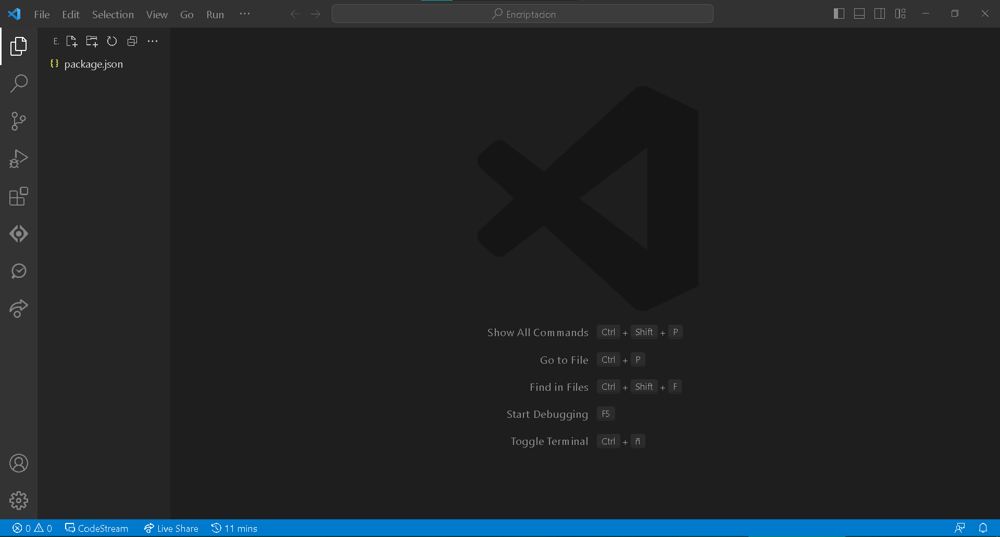

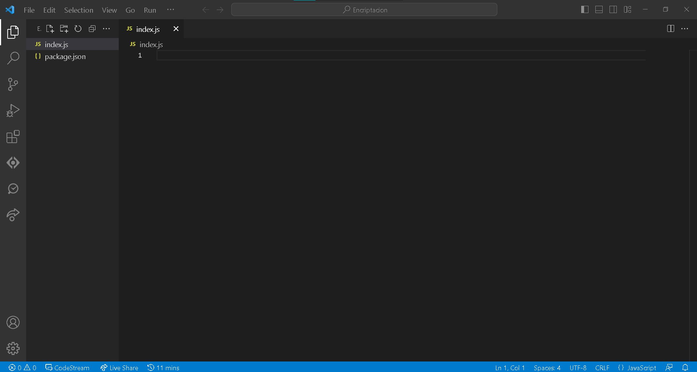

Ahora vamos a instalar las librerías básicas que necesitamos para este proyecto.

```
npm i -s chai
npm i -s chai-http
npm i -s express
npm i -s mocha
npm i -s mochawesome
npm i -s nyc
npm i -s sinon
```

### Paso 2 Creación de formulario de archivos
Una vez, que tenemos instaladas las librerías vamos a crear un archivo **index.html** y vamos a agregar el siguiente form.

```
<!DOCTYPE html>
<html lang="en">
    <head>
        <meta charset="UTF-8">
        <meta name="viewport" content="width=device-width, initial-scale=1.0">
        <title>Hello World Simple App</title>
    </head>

    <body>
        <h1>Hola Mundo</h1>
    </body>
</html>
```

### Paso 3 Configuración del backend

Ahora vamos a regresar al **index.js** y vamos a copiar la siguiente configuración inicial.

En primer lugar vamos a trabajar con los import y configuraciones iniciales, estas no deberían de tener mayor problema.

```
const express  = require('express');
const path     = require("path")
const fs       = require("fs")
const app = express();

const log = console.log
```

Ahora vamos a empezar con algo diferente y es la definición de nuestras variables de ambiente.

Como tal una **variable de ambiente** ayuda a definir comportamientos con los que queremos trabajar ciertas variables, por ejemplo: el **puerto** en el que corre la aplicación debería ser diferente para cada ambiente, si pudieramos definirlo sería algo como lo siguiente:

```
DESARROLLO: 5000
PRODUCCIÓN:5005
PRUEBA: 50001
```

Separar cada ambiente ayuda con el control de calidad en el proyecto, grandes empresas separan sus ambientes de acuerdo a la necesidad y tamaño que tienen para cada proyecto.

Idealmente debemos entender que debería existir el ambiente de **DEV** que es donde programamos, la configuración debe tener su propia base de datos para evitar tocar los datos de producción. **PROD** es el ambiente final donde tocamos los datos reales y **TEST** donde este último no debe guardar información y no debe estar corriendo sino más bien se debe ejecutar en aislamiento para asegurar que las pruebas no dependen de flujos completos de información.

Este laboratorio no cubre el como realizar pruebas, sino el como configurar un entorno automático y algunas librerías con las que se pueden adaptar las estrategias de pruebas más comunes del sistema.

Ahora bien, lo que necesitamos agregar a nuestro archivo **index.js**

```
let rawdataTesting       = fs.readFileSync(path.resolve(__dirname, 'test-environment.json'))

let TESTING_ENVIRONMENT  = JSON.parse(rawdataTesting)

const port = process.env.PORT || TESTING_ENVIRONMENT.PORT || 5000
app.set("port", port);
```

En la primera línea vamos a leer un archivo en formato .json, este no es forzoso que tenga esta configuración pero a partir de ello podemos definir la configuración del ambiente de pruebas de **TEST**. La línea 3 convierte la lectura del archivo en un objeto json funcional.

La línea 5 nos muestra como usar las variables de ambiente y usar los diferentes entornos que definimos, el ambiente de pruebas es propio por lo que solo llamamos al archivo que tenemos, el segundo es la llamada a los entornos de **DEV** y **PROD** que vamos a definir más adelante y por último en caso de no encontrar la variable se puede definir un valor default. En este caso dependiendo la variable se puede tener un valor default o no pero si en las pruebas se debe contemplar que este valor default no afecte el comportamiento final esperado.

En el siguiente paso vamos a definir el entorno de **TEST**, pero por ahora terminemos de configurar **index.js**.

Lo siguiente es definir las url del proyecto, de momento vamos a definir 3

```
/test GET
/ GET nuestro index que llama al html
/* GET para el manejor de errores
```

Por lo tanto necesitamos agregar lo siguiente

```
app.get('/test', function(req, res) {
    res.status(200).send({status:"success",message:"Welcome To Testing API"})
});

app.get('/', (req, res) => {
    res.sendFile('index.html', {root: __dirname});
});

app.get('*', function(req, res){
    res.status(404);

    // respond with json
    if (req.accepts('json')) {
        res.send({ error: 'Not found' });
        return;
    }

    // default to plain-text. send()
    res.type('txt').send('Not found');
});
```

Ahora vamos a declarar la inicialización del servidor pero nota que empezamos a usar la variable de **port** para que inicie según el ambiente.

```
app.listen(port, () => {
//server starts listening for any attempts from a client to connect at port: {port}
    console.log(`Now listening on port ${port}`);
});
```

**Por último y quizás la línea más importante debemos agregar un export de esta configuración para que nuestro entorno de pruebas pueda ser ejecutado correctamente.**

```
module.exports = app;
```

Por tanto el código final de **index.js** debería verse como lo siguiente

```
const express  = require('express');
const path     = require("path")
const fs       = require("fs")

const app = express();
const log = console.log

let rawdataTesting       = fs.readFileSync(path.resolve(__dirname, 'test-environment.json'))
let TESTING_ENVIRONMENT  = JSON.parse(rawdataTesting)

const port = process.env.PORT || TESTING_ENVIRONMENT.PORT || 5000
app.set("port", port);

app.get('/test', function(req, res) {
    res.status(200).send({status:"success",message:"Welcome To Testing API"})
});

app.get('/', (req, res) => {
    res.sendFile('index.html', {root: __dirname});
});

app.get('*', function(req, res){
    res.status(404);
    // respond with json
    if (req.accepts('json')) {
        res.send({ error: 'Not found' });
        return;
    }

    // default to plain-text. send()
    res.type('txt').send('Not found');
});

app.listen(port, () => {
//server starts listening for any attempts from a client to connect at port: {port}
    console.log(`Now listening on port ${port}`);
});

module.exports = app;
```

### Paso 4 Creación del ambiente de pruebas

Normalmente podríamos ejecutar el proyecto y empezar a trabajar, pero ahora que definimos la variable de ambiente del puerto entonces necesitamos generar nuestros ambientes para poder trabajar.

Lo que haremos ahora es crear un archivo llamado **test-environment.json** al cual vamos a añadir lo siguiente.

```
{
    "NAME": "Project TEST",
    "APP_NAME": "My Project",
    "PORT": 5001,
    "NODE_ENV": "development"
}
```

Algunas variables de ambiente son propias de NodeJS, tal es el caso de **NODE_ENV** la cual solo admite los valores **development** y **production** como consideramos que **TEST** es parte de desarrollo por eso asignamos **development**.

### Paso 5 Configuración de Pruebas Automáticas

Ahora vamos a comenzar a configurar las pruebas a través del ambiente de pruebas que acabamos de crear.

Para esto necesitamos crear una nueva carpeta en el proyecto que se llame **test** y dentro de esta nueva carpeta vamos a definir el siguiente archivo **1_app.test.js**, este archivo tiene este nombre ya que al momento de ejecutar las pruebas, el motor lo hace con todos los archivos de la carpeta **test** pero queremos que este en particular se ejecute primero, esto para hacer algunas pruebas de configuración del proyecto, ya después podemos definir pruebas por módulo, por función o como más nos funcione.

Para comenzar vamos a añadir todos los imports necesarios para trabajar en **1_app.test.js**

```
const app      = require("../index")
const chai     = require("chai")
const should   = require("chai").should()
const assert   = require('chai').assert
const expect   = require('chai').expect
const chaiHttp = require("chai-http")
const path     = require("path")
const fs       = require("fs")
const sinon    = require('sinon')

const log      = console.log

chai.use(chaiHttp)

let rawdataTesting       = fs.readFileSync(path.resolve(__dirname, '../test-environment.json'))

let TESTING_ENVIRONMENT  = JSON.parse(rawdataTesting)
```

Aquí podemos notar el uso de la librería **chai** que es la que nos va a permitir trabajar con las igualaciones y las pruebas que necesitemos trabajar con verificaciones. También vemos el uso de **sinon** esta librería es muy poderosa en el sentido que permite realizar **mock** o sustituir valores de salida de funciones, no vamos a abarcar su funcionamiento en este laboratorio pero su documentación es bastante extensiva en como se puede utilizar y es todo lo necesario para realizar pruebas unitarias.

Ahora vamos a hacer uso de la librería de **mocha** esta nos permite segmentar nuestras pruebas en casos de prueba haciendo más fácil tanto la definición del código como la visualización final al momento de ejecutarlas.

Para iniciar vamos a definir una módulo de prueba con el siguiente código

```
describe("Server configurartion", () => {

})
```

Y para definir nuestra primera prueba vamos a definir lo siguiente adentro de esta primera configuración anterior

```
describe("Test Environment", () => {
	it("Correct Port", done => {
		assert.equal(app.locals.settings.port, TESTING_ENVIRONMENT.PORT, 'Port should be')
		done()
	})
	it("Correct Environment", done => {
		assert.equal(app.locals.settings.loc_env, TESTING_ENVIRONMENT.LOC_ENV, 'Environment should be')
		done()
	})
})
```

Esta forma sería la definición más básica de una prueba, donde definimos el caso **Test Environment**, a partir de la prueba definimos varios casos que debe cumplir, en este caso **Correct Port** y **Correct Environment**. Para cada sub-prueba revisamos que cumpla con **chai**  haciendo un **assert** y verificando tanto el **port** como el **ENV** que tenemos.

Estas pruebas son muy sencillas, así que vamos a ejecutarlas y que veas que configurar las pruebas automáticas es algo muy sencillo.

Para hacerlo vamos a abrir nuestro archivo **package.json**, y en la sección de **scripts** vamos a sustituir el de **test** por lo siguiente

```
"test": "mocha --reporter mochawesome --timeout 10000 --exit"
```

Esta configuración es la corrida de pruebas básica del proyecto. Si ejecutas **npm run test** observa lo que aparece.

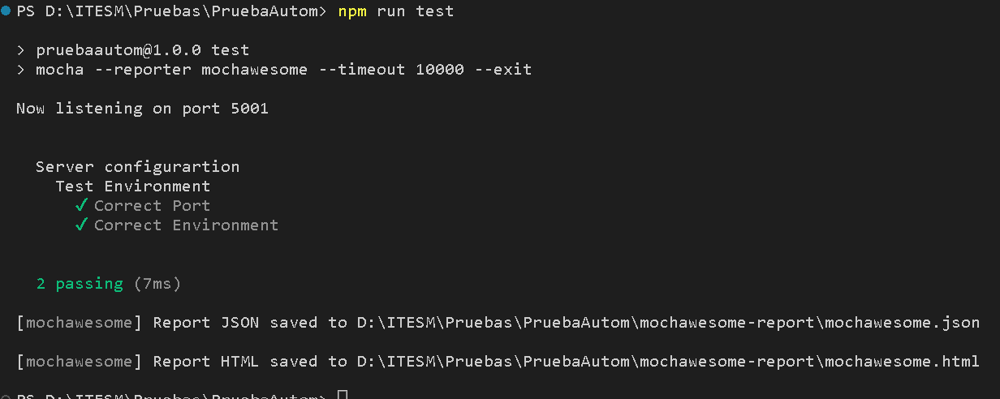

Dentro de la consola se hace el desglose de las 2 pruebas que ejecutamos diferenciadas por el nombre de la prueba **Test Environment** y el módulo que en este caso es  **Server Configuration**, puedes desarrollar tantas diferenciaciones como necesites y lo puedes ajustar a tu estrategia de pruebas.

Además observa que la librería **mochawesome** nos genera dentro del proyecto unas carpetas adicionales

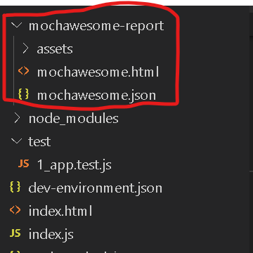

Este es un reporte adicional que podemos tomar para no solo usar la consola para administrar el avance de las pruebas.

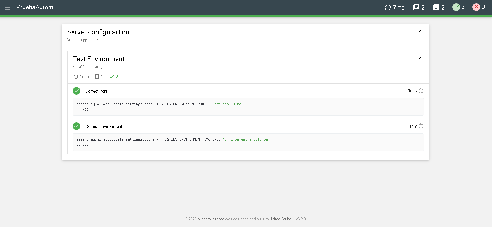

Para manejar nuestras pruebas de manera básicas esto sería suficiente, pero que tal si añadimos un poco más de complejidad para tener un mejor nivel de detalle.

Dentro de nuestro **package.json** vamos a añadir un **script** adicional al de **test** al que llamaremos **testFull** y se verá como lo siguiente.

```
"testFull": "nyc --reporter=html --reporter=text mocha --reporter mochawesome --timeout 10000 --exit"
```

Por tanto la sección de **scripts** del **package.json** deberá contener lo siguiente

```
"scripts": {
    "test": "mocha --reporter mochawesome --timeout 10000 --exit",
    "testFull": "nyc --reporter=html --reporter=text mocha --reporter mochawesome --timeout 10000 --exit"
  },
```

Y si ahora ejecutamos **npm run testFull** el resultado nos manda lo siguiente

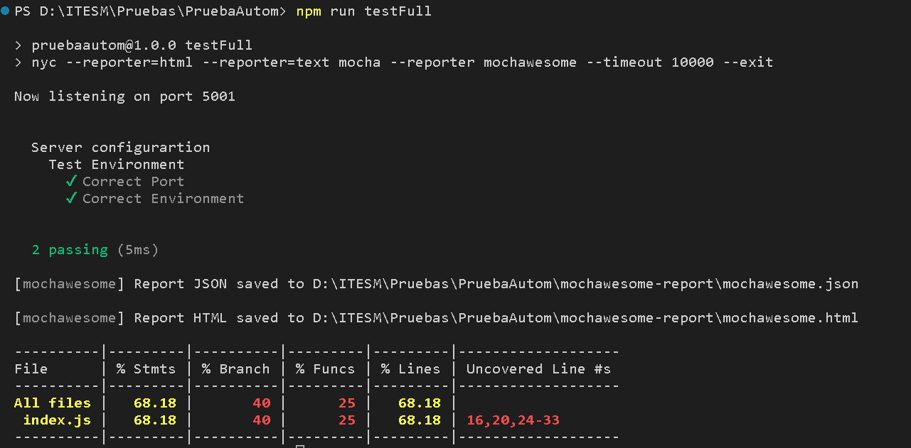

Nuevamente obtenemos el resultado y se crear el reporte de mochawesome, pero ahora usamos la librería **nyc** para generar un reporte del **test coverage** del proyecto.

Aquí vemos que el archivo **index.js** es el que se está probando y el porcentaje de alcance que estamos cubriendo.

**Nota: En un mundo ideal el test coverage de un proyecto debería de ser del 100%, esto significa que se cubren todos los módulos, de todas las funciones de todos los flujos. Esto por obvias razones es complejo, costoso y muchas veces no representa la calidad del proyecto en su totalidad, por lo que es trabajo del equipo definir que se debe probar efectivamente.**

De nueva cuenta el generado nos crea una carpeta para nyc que contiene el reporte en html del coverage del proyecto.

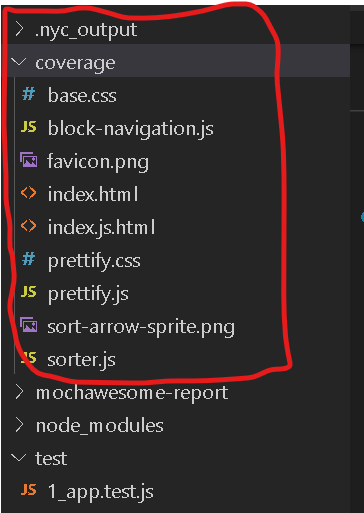

Aquí vamos a poder ver con total detalle el coverage de la siguiente forma.

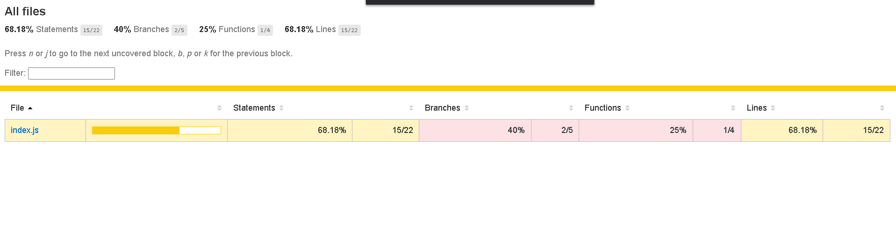

Aunque similar a lo que observamos en la consola aquí podemos seleccionar **index.js** y entrar a ver más detalles del reporte.

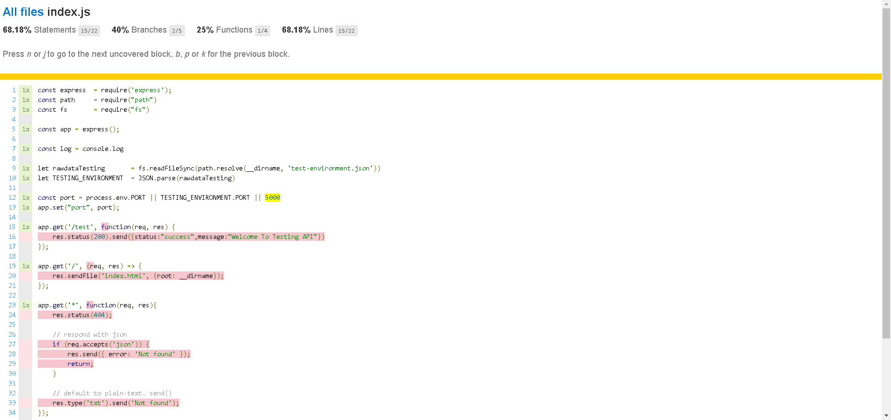

Viendo el detalle podemos ver que partes del código aún no han sido probadas, en caso de que el proyecto contenga diferentes archivos de prueba nyc hace la suma de todo y genera el reporte total de pruebas.

Con esto tenemos configurado todo el ambiente de pruebas del proyecto.

Ahora vamos a complementar las pruebas del proyecto con las siguientes.

```
describe("Basic Connection", () => {
	it("Call to /test", done => {
		chai
		.request(app)
		.get("/test")
		.end((err, res) => {
			expect(res).to.have.status(200)
			expect(res.body.status).to.equals("success")
			expect(res.body.message).to.equals("Welcome To Testing API")
			done()
		})
	})
})

describe("Scenario: INTEGRATION TEST Error url cannot be found", () => {
	it("GIVEN and error url", done => {
		chai
		.request(app)
		.get("/*")
		.end((err,res) => {
			done()
		})
	})

	it("WHEN obtaining a 404 error code", done => {
		chai
		.request(app)
		.get("/*")
		.end((err,res) => {
			expect(res).to.have.property("status")
			done()
		})
	})

	it("THEN the result is URL does not exist message", done => {
		chai
		.request(app)
		.get("/*")
		.end((err,res) => {
			expect(res).to.have.status(404)
			done()
		})
	})
})

describe("Scenario: UNIT Test a json call not found", () => {
	it("GIVEN a url that usesreq.accepts('json')", done => {
		chai
		.request(app)
		.get("/*")
		.set('Accept', 'application/json')
		.end((err,res) => {
			done()
		})
	})

	it("THEN obtaining an error", done => {
		chai
		.request(app)
		.get("/*")
		.set('Accept', 'application/json')
		.end((err,res) => {
			done()
		})
	})
})
```

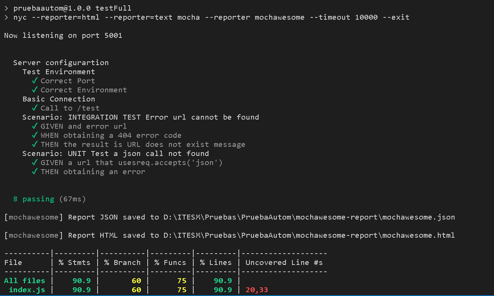

Esto aumenta nuestros escenarios de prueba y por tanto el coverage de nuestro proyecto.

Como ejercicio revisa las pruebas declaradas y entiende como funcionan así como la sintaxis de **chai-http** para poder probar urls completas de tu proyecto.

De aquí lo que necesitas es adentrarte en el mundo de pruebas para poder ver como completar la pirámide de pruebas con pruebas unitarias y pruebas de integración. Para realizar pruebas de interfaz el camino es diferente y depende más de como se haya desarrollado el front end o la usabilidad que tenga el proyecto ya que podría ser no solo web, sino móvil.

### Paso 6 Ambientes adicionales

Ya que terminamos de configurar pruebas vamos a terminar con el ambiente de **DEV** y **PROD**.

Para **DEV** vamos a crear un nuevo archivo llamado **dev-environment.json** y deberá incluir lo siguiente

```
{
    "apps" : [{
    "name" : "Project DEV",
    "script" : "index.js",
    "watch": ["cloud","functions","index.js","controllers","models","1_global_module"],
    "watch_options": {
        "useFsEvents": false
    },

    "ignore_watch" : ["public/", "node_modules/", "logs"],
    "env": {
        "NAME": "Project DEV",
        "APP_NAME": "Project DEV",
        "PORT": 5000,
        "NODE_ENV": "development"
    }
    }]
}
```
 Para PROD vamos a crear el archivo llamado **prod-environment.json** y su contenido será el siguiente

```
{
    "apps" : [{
    "name" : "Project PROD",
    "script" : "index.js",
    "watch": ["cloud","functions","index.js","controllers","models","1_global_module"],
    "watch_options": {
        "useFsEvents": false
    },

    "ignore_watch" : ["public/", "node_modules/", "logs"],

    "env": {
        "NAME": "Project PROD",
        "APP_NAME": "Project PROD",
        "PORT": 5005,
        "NODE_ENV": "production"
    }
    }]
}
```

Estas dos configuraciones son plantillas generales y nota que no solo incluyen las variables de ambiente, sino que archivos debe observar e ignorar un proyecto común de NodeJS.

Estas configuraciones de ambiente son para una librería que nos permite ejecutar continuamente el proyecto, esto funcionará tanto para el servidor como en entornos locales. La librería quizás ya la conozcas es **pm2**, algo importante de esta librería es que no se recomienda instalarla solo en el proyecto sino que se recomienda tenerla de manera global tanto en tu computadora como en el servidor, por cuestiones de administración de recursos. Por tanto para instalarla sería

```
npm i -g pm2
```

Una vez instalado podemos usar los siguientes comandos para su buen manejo

```
pm2 start {index.js|archivo.conf.json}
pm2 stop {index.js|archivo.conf.json}
pm2 delete {index.js|archivo.conf.json}
pm2 save //Guarda localmente una configuración activa
pm2 resurrect //Corre la configuración guardada en ese momento
pm2 kill //Mata todos los procesos corriendo en ese momento
pm2 logs //Nos permite acceder a la consola para ver los logs
```

Entonces para nuestro proyecto podemos ejecutar lo siguiente

```
pm2 start prod-environment.json
pm2 start dev-environment.json
```

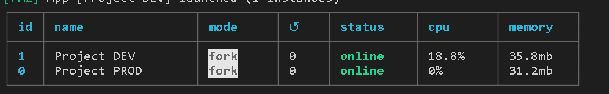

Mientras el **status** se mantenga en **online** significa que esta corriendo efectivamente, si cambia a **stopped** es que algún error lo detuvo y es necesario revisar el log, otro estatus de es **errored** este es más severo por que el error encontrado fue más abrupto.

**Nota: En ocasiones la columna al lado del estatus la cual tiene un número en 0, verás que empieza a aumentar, esto significa la cantidad de restarts del proyecto, si actualizas por ejemplo el archivo index.js y lo guardas, debería de aumentar el contador por que la configuración de ambiente observa cambios en este archivo. Ahora bien, si ves que este número incrementa solo varias veces seguidas al ejecutar pm2 ls, significa que tienes un error que no mata el servidor pero que lo reinicia continuamente.**

Entra a tu navegador a 

```
http://localhost:5000/
http://localhost:5005/
```

Y verás que ambos entornos corren sin problemas, y más aún vuelve a ejecutar **npm run testFull** y ningún ambiente debe estorbarse entre sí para funcionar.

No te recomiendo correr **testFull** siempre ya que cuantas más pruebas tengas más tardado se tornará, usa la configuración simple para ejecuciones continuas y el full solo en cortes de revisión del coverage específicos.

Busca los recursos en las páginas oficiales de mocha, chai, sinon y nyc para aprender a usar los métodos de las pruebas.

Usa también el siguiente tutorial para reforzar lo aprendido.

https://blog.logrocket.com/node-js-unit-testing-mocha-chai-sinon/