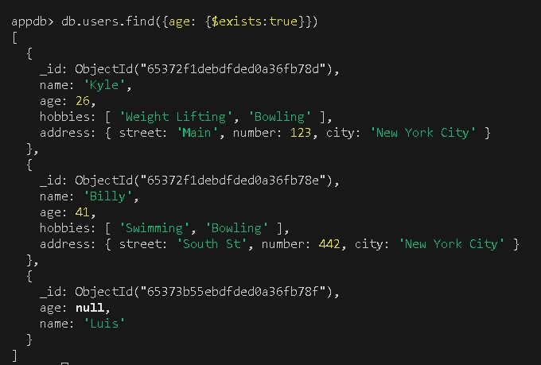
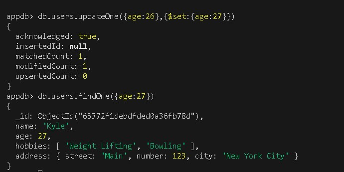

# MongoDB Crash Course

## Objetivo

En este laboratorio aprenderemos los básicos de la Base de Datos No Relacional MongoDB, una de las más populares en el mercado.

En este laboratorio vamos a explorar los comandos básicos del levantamiento de la Base de Datos, así como algunas herramientas útiles de libre acceso que puedes utilizar para mejorar tu experiencia con esta Base de Datos.

**Nota: Como recomendación, si ya tienes conocimiento en Bases de Datos Relacionales, no tires tu conocimiento y experiencia, lo mejor de las nuevas Bases de Datos es un enfoque híbrido que utiliza lo mejor de ambos mundos para atacar el principal problema: modelar y presentar información de la manera más rápida y profunda posible.**

## Instrucciones

Sigue los pasos descritos en la siguiente práctica, si tienes algún problema no olvides que tus profesores están para apoyarte.

## Laboratorio
### Paso 1 Introducción

El primer paso que tenemos que realizar es instalar MongoDB en nuestra computadora de uso. Una de las preguntas iniciales es ¿Desde dónde corre? La respuesta es que en la mayoría de los Sistemas Operativos, al menos en todos los conocidos como son: **Windows**, **MacOS** y **Linux**. Algo importante a destacar de MongoDB es que de Open Source, sin embargo no significa que no tenga sus versiones Empresariales. Por lo tanto al momento de adentrarte en la [página oficial](https://www.mongodb.com/)verás que existen un gran número de productos asociados a MongoDB, desde los servicios de servidores dedicados como Atlas, como algunos otros que ofrecen para manejo de Análisis de Datos, Backend as a Service (BAAS), entre otros.

Sea que vayas a instalar MongoDB en un servidor o en tu computadora el servicio que vas a buscar es el  **Community Edition**. Por tanto desde la página principal vete a **Productos->Community Edition->Community Server**. Esta es la instalación más simple de Mongo que puedes realizar.


Después selecciona la versión correspondiente a tu máquina. En caso de que vayas a realizar una instalación para servidor te recomiendo la instalación directa por línea de comando.

**Nota: Algo importante en la instalación de MongoDB es que aunque las versiones son compatibles entre sí, es bastante común que las configuraciones cambien bastante, esto puede llevar a que versiones previas no funcionen correctamente, y es altamente recomendable que si tienes una base de datos con una versión anterior puedas exportarla e importarla en una versión más reciente.**

La guía oficial de instalación podrás revisarla [aquí](https://www.mongodb.com/docs/manual/administration/install-community/). En estas guías puedes seleccionar la versión específica que quieres instalar en conjunto con el Sistema Operativo correspondiente.

Otro punto importante a tener en cuenta es que si instalas la base de datos en tu computadora personal es que tengas bien claro que es para cargar un ambiente local. Dependiendo el proyecto que ejecutes esto puede ser bueno o malo. En ocasiones esto sirve para verificar comportamientos específicos con la base de datos sin mover los entornos, o en ocasiones para ver el comportamiento en diferentes redes.

Mi recomendación es que desde el inicio del proyecto hagas un despliegue total de tu proyecto en un servidor y más allá del backend, tengas una base de datos de desarrollo y producción que puedas acceder desde cualquier parte. Esto te evitará generar muchas configuraciones y permitirá a un equipo de trabajo poder estar manipulando y experimentando además de ya tener preparada la base de datos  **buena** de producción.

También no olvides instalar [mongosh](https://www.mongodb.com/docs/mongodb-shell/?_ga=2.15273599.891434750.1698110546-1873709171.1690739567) para poder ejecutar comandos desde tu terminal.

**Nota: Algo a considerar con los usuarios de Windows y sobre todo si llegaras a instalar en Windows Server, pero también aplica para computadoras normales, es asegurarte que MongoDB se instala y corre como Servicio. Ya que es lo que permite que en cada reinicio de computadora se ejecute automáticamente. En computadoras normales esto es fácil, pero en Windows Server a veces por configuración esto no se permite entonces deberás buscar la manera ya que de lo contrario si el servidor se apaga también tu base de datos.**

### Paso 1 Comandos Básicos

Ahora vamos a abrir Visual Studio Code, y desde adentro vamos a ejecutar una terminal.

Una vez adentro ejecutamos el comando **mongosh** y nos deberá aparecer algo como lo siguiente


Una vez ejecutado el comando observa el **promt** que aparece

```
test>
```

Al momento de entrar con **mongosh** entramos al modo de base de datos, por tanto cargamos la base de datos default que trae y en este caso se llama **test**. 

Desde aquí ya podemos empezar a ejecutar algunos comandos, por ejemplo, si queremos ver las bases de datos que tenemos en nuestra instancia que estamos viendo podemos ejecutar lo siguiente:

```
test> show dbs
```


Como el comando nos dice, muestra las bases de datos actuales. Otro punto importante a tomar en cuenta es que **mongosh** puede recibir parámetros adicionales, que pueden ser para conectarse a bases de datos remotas. En nuestro caso al no poner nada estamos diciendo a mongo que son las bases de la configuración local.

Este punto es importante ya que por default MongoDB no viene protegido y corre desde el puerto **27017**, para pruebas no pasa nada, pero para un ambiente de producción esto es la peor configuración ya que actualmente existe un hackeo a bases de datos MongoDB que mata su información y pide dinero a cambio para recuperarlo. Este problema se corrige bloqueando y cambiando la configuración default pero aunque el hack viene de 2017 es la principal causa de que los novatos en MongoDB se vean afectados. Te dejo el [link](https://www.healthcareitnews.com/news/emory-healthcare-hit-ransomware-data-over-200000-patients-hacked) a la noticia que habla del tema ya que es un tema interesante desde el punto de vista de seguridad actual.

En tu caso deberías ver solamente las Bases de Datos

- admin
- config
- local
Las demás son bases de datos que se van creando con cada proyecto desarrollado.

Vamos a crear una nueva base de datos ejecutando el siguiente comando:

```
test> use appdb
```

Este comando crea una nueva base de datos si no existe y si ya existe la selecciona para seguir utilizándola.


Ahora vamos a pensar que ya existieran datos en esta Base de Datos, el primer paso a consultar serían las colecciones, recuerda la analogía con SQL, en MongoDB la colecciones son las tablas. Para consultarlas ejecutamos:

```
appdb> show collections
```

Como nuestra base de datos está vacía no debería de devolvernos ningún valor. Pero en el caso de que sí vamos a borrar la base de datos para asegurarnos un inicio limpio. Para ello ejecutamos lo siguiente.

```
appdb> db.dropDatabase()
```


En automático se elimina nuestra base de datos. Observa que los comandos de MongoDB son similares a una sintaxis tipo Javascript, esto es a propósito, ya que uno de los mayores usos de MongoDB es a través de sistemas que utilizan NodeJS. 

Para evitar estar saltando la línea para ver la información en pantalla podemos ejecutar el comando:

```
appdb> cls
```


Nuevamente si ejecutamos **show dbs** veremos que **appdb** no se encuentra listada justo por que la eliminamos.


También si eres observador notarás que el promt sigue manteniendo el nombre de **appdb**


No te preocupes, esto es normal, y es una de las mejores capacidades de MongoDB contra SQL. Ya que aunque no tengamos la base de datos creada, si empezamos a trabajar en ella añadiendo información, de manera automática MongoDB creará la base de datos, con su colección correspondiente evitando las molestas migraciones que se tienen que realizar en otras bases de datos.

**Nota: Un gran poder conlleva una gran responsabilidad, recuerda que al crearse de manera automática, se delega toda la responsabilidad al programador para mantener unicidad con los nombres de sus Bases de Datos, Colecciones y Columnas.**

Por último vamos a finalizar la sesión utilizando el comando:

```
appdb> exit
```

Esto nos devolverá a la terminal. Si volvemos a ejecutar **mongosh** nuevamente nos pasa a la bd local que es **test**.


Nuevamente vamos a introducir el comando:

```
test> use appdb
```

### Paso 2 Comandos de Inserción

Ya que estamos dentro de nuestra Base de Datos, observa que si ejecutamos el comando:

```
appdb> db
```


Vamos a tener exactamente la base de datos donde nos encontramos, desde aquí puedes ver el objeto **db** en una forma de árbol donde lo que sigue nos permite introducir colecciones y luego datos. Entonces para crear una colección **users** e insertarle un objeto de Javascript que en esencia es un objeto JSON, debemos hacer lo siguiente:

```
appdb> db.users.insertOne({ name:"Alex"})
```


Observa que el resultado nos dice que se ejecutó correctamente y el nuevo objeto tiene un Id **653728daebdfded0a36fb789**, también observa que no necesitamos crear la colección previamente, sino que al vuelo creamos **users**, es más, si ejecutamos **show collections** nota el cambio.


Ahora, para hacer un query a toda la colección solo basta con ejecutar lo siguiente:

```
appdb> db.users.find()
```


Nuevamente observa el formato que regresa MongoDB al ejecutar un query. También sigue en cuenta que no hemos definido ningún esquema a la Base de Datos, tan solo insertamos el JSON que queríamos en la colección. Recuerda que a nivel de teoría cada objeto que insertamos a la tabla es llamado un **Document**, con esto complementamos la línea, los **Document** viven dentro de las **Collection** y estos a su vez viven dentro de las **DB**.

Al no tener un esquema los **Document**, esto permite tener variaciones en los datos que a primera vista son las columnas, por lo tanto estas variaciones hacen de cada objeto algo único que se puede trabajar y modelar.

Ahora vamos a agregar un nuevo objeto a la base de datos, pero esta vez lo haremos más complejo con información anidada:

```
appdb> db.users.insertOne({ name:"Den", gender:"female", address: {street:"Epigmenio Glez", number:500}, hobbies:["Swimming"]})
```

Nuevamente hacemos el query usando el **find()** y obtendremos lo siguiente:


Ahora observa los diferentes tipos de datos que podemos almacenar en un **Document**:

- Strings
```
name: 'Den'
```
- Objetos
```
address: { street: 'Epigmenio Glez', number: 500 }
```
- Arrays o listas
```
hobbies: [ 'Swimming' ]
```
- Ints
```
number: 500
```

Existen otros como los boolean o tipos de datos primitivos, pero en su mayoría los más importantes son estos.

Ahora vamos a insertar varios **Document** de golpe, para ello usaremos la función **insertMany**. A diferencia de la anterior **insertOne** que recibe un objeto, esta recibe un arreglo o lista de objetos.

```
appdb> db.users.insertMany([{name:"Oscar"},{name:"Liz"}])
```

Nuevamente si ejecutamos el **find()**, el resultado será el siguiente:


Como ejercicio de esta lección intenta agregar la siguiente lista de usuarios:

```
[
	{
		name:"Kyle",
		age:26,
		hobbies:["Weight Lifting", "Bowling"],
		address:{
			street: "Main",
			number: 123,
			city: "New York City" 
		}
	},
	{
		name:"Billy",
		age:41,
		hobbies:["Swimming", "Bowling"],
		address:{
			street: "South St",
			number: 442,
			city: "New York City" 
		}
	}
]
```

**Aquí esta la respuesta pero intenta hacerlo tu mismo, de nada sirve hacer solo copy paste si no aprendes efectivamente los comandos.**

```
appdb> db.users.insertMany([{name:"Kyle",age:26, hobbies:["Weight Lifting", "Bowling"], address:{ street: "Main", number: 123, city: "New York City" }},{ name:"Billy", age:41, hobbies:["Swimming", "Bowling"], address:{street: "South St", number: 442, city: "New York City" }}])
```


### Paso 3 Comandos de Búsqueda (Queries)

Como ya vimos, **db.users.find()** nos devuelve la información de la colección que estamos seleccionando, pero también podemos agregar más parámetros al **find** para filtrar la información. El comando limit nos limitará el número de resultados devueltos por la búsqueda.

```
appdb> db.users.find().limit(2)
```


Ahora, si queremos ordenar por decir en orden alfabético, esto lo podemos hacer con la función sort, que recibirá un JSON como parámetro que contendrá la columna que queremos ordenar junto con el valor **1** para orden alfabético o **-1** para el inverso.

```
appdb> db.users.find().sort({name:1}).limit(2)
```

```
appdb> db.users.find().sort({name:-1}).limit(2)
```

Observa los diferentes resultados.


Ahora vamos a hacer un ordenamiento compuesto donde primero ordene por edad y luego por nombre, para ello hacemos lo siguiente:

```
appdb> db.users.find().sort({age:1,name:-1}).limit(2)
```


En esta primera vuelta los 2 objetos no contienen **age** por lo tanto nos lo regresa primero, pero si hacemos el inverso observa el cambio.

```
appdb> db.users.find().sort({age:-1,name:-1}).limit(2)
```


Ahora si queremos escapar el primer resultado podemos usar la función **skip**, con esta podemos hacer algo como lo siguiente:

```
appdb> db.users.find().limit(2)
```

Esto nos devuelve los primeros resultados, pero si queremos saltar el primero hacemos lo siguiente:

```
appdb> db.users.find().skip(1).limit(2)
```


Ahora para empezar con queries más certeros, vamos a buscar a todos los que llenen un requisito particular.

```
appdb> db.users.find({ name: "Kyle" })
```


Nuevamente observa como **find()**, recupera la información recibiendo como parámetro un objeto JSON. Si hacemos alguna variación sigue funcionando:

```
appdb> db.users.find({ age: 26 })
```


También nota que pasa si cambiamos el parámetro por algo no existente.

```
appdb> db.users.find({ age: "26" })
```


Ahora si estamos acostumbrados a la sintaxis de SQL, un query normal tiene el formato:

```
SELECT *
FROM table
WHERE clauses
```

Al momento, solo hemos trabajado con el FROM y el WHERE, pero ¿quÉ pasa con el SELECT?

Para decirle a MongoDB que seleccione solo ciertas columnas del **Document** debemos pasar un segundo parámetro al **find()** que son todas las columnas que queremos recuperar, en este caso con el número **1** para dar a entender que son las columnas que queremos visualizar, entonces para nuestro caso debemos realizar lo siguiente:

```
appdb> db.users.find({name:"Kyle"},{name:1,age:1})
```


De manera automática también se regresa el **id**, pero si aún así no lo queremos podemos extender el objeto con lo siguiente:

```
appdb> db.users.find({name:"Kyle"},{name:1,age:1,_id:0})
```


Una mala práctica de los nuevo en MongoDB es no realizar la selección de columnas y acostumbrarse a regresar todo. Desde un punto de vista casual esto no te dará problemas, pero cuando empieces a trabajar con bases de datos de más de 5000 elementos empezarás a ver reducciones en el performance de la aplicación debido a los tiempos que le toma a MongoDB recuperar la información, y entre más datos, más lento se hace esto.

Ya viste como el uso de **1** le dice a MongoDB que ese es el campo que queremos, de la misma manera el **0**, le dice que no queremos el campo. Por tanto al igual que en SQL, es cuestión de estrategia como escribes tus queries para obtener la información necesaria, ya que el siguiente comando sería valido para obtener todo menos el campo **age**.

```
appdb> db.users.find({name:"Kyle"},{age:0})
```


Ahora vamos a empezar con queries complejos. Para ello vamos a escribir el siguiente comando:

```
appdb> db.users.find({name: {$eq:"Den"}})
```


Este comando recibe dentro del nombre otro objeto con los parámetros del query complejo que queremos ejecutar, en este caso recibe la operación **eq** o equals que debe ser colocado después del símbolo **$**.

Por tanto es que query ejecuta el filtro a todos los **Document** cuyo nombre sean iguales a **Den**.

Pero ahora vamos a hacer lo inverso, obtener todos los **Document** cuyo nombre no sea igual a **Den**, para hacerlo usaremos **ne**. Intenta hacer el query tu mismo antes de ver la respuesta.

```
appdb> db.users.find({name: {$ne:"Den"}})
```


Algunos parámetros adicionales serían **gt**, greater than:

```
appdb> db.users.find({age: {$gt:26}})
```


Parámetros adicionales serían **gte**, greater than equal:

```
appdb> db.users.find({age: {$gte:26}})
```


Parámetros adicionales serían **lte**, less than equal:

```
appdb> db.users.find({age: {$lte:40}})
```


Parámetros adicionales serían **lt**, less than:

```
appdb> db.users.find({age: {$lt:26}})
```


También podemos hacer queries donde a partir de una lista de datos cheque si existe con el parámetro **in**.

```
appdb> db.users.find({name: {$in:["Alex","Den"]}})
```


**Nota: Empieza a poner atención, los resultados como el anterior siguen lógica de conjuntos y es importante entender cuando el query ejecuta un AND o un OR, en el caso anterior el in recibe una lista y el query busca en todo lo que contenga A o B.**

Parámetros adicionales serían **nin**, not in:

```
appdb> db.users.find({name: {$nin:["Alex","Den"]}})
```


Parámetros adicionales serían **exists**, para filtrar contra los que no tienen un parámetro en particular:

```
appdb> db.users.find({age: {$exists:true}})
```


```
appdb> db.users.find({age: {$exists:false}})
```


Este **exists** solo verifica que la llave en este caso **key** no exista, ya que podemos tener el caso de un **Document** que tenga algo como:

```
age: null
```

En este caso si se contaría en el regreso de datos ya que la llave si existe. Esto podemos verlo con el siguiente ejemplo:

```
appdb> db.users.insertOne({age:null,name:"Luis"})
```

Si volvemos a ejecutar:

```
appdb> db.users.find({age: {$exists:true}})
```



Ahora vayamos agregando más complejidad a los queries con lo siguiente y resuelve ¿Qué hace este query?:
```
appdb> db.users.find({age: {$gte:20, $lte:40}})
```


**Nota: Observa que a diferencia del in donde el query buscaba en A o B, cuando empezamos a anidar parámetros cada uno genera un AND, por tanto el query anterior ejecuta un greather than equal && less than equal.**

Identifica los siguientes queries:

```
appdb> db.users.find({age: {$gte:20, $lte:40}, name:"Den"})
```

```
appdb> db.users.find({age: {$gte:20, $lte:40}, name:"Kyle"})
```

Otra forma de escribir el query anterior sería usando el parámetro **and** que también nos ayuda a ejecutar queries en formato AND que sean más lógicos de manera visual.

```
appdb> db.users.find({$and: [{age:26},{name:"Kyle"}]})
```

**Nota: Por lo general casi todos los queries que necesites serán del tipo AND, por lo que la última sintaxis no es tan común, sin embargo algo que si puedes necesitar son los OR, por lo que la forma de realizarlos es la misma que con $and, pero sustituyendo con $or.

```
appdb> db.users.find({$or: [{age:{$lte:29}},{name:"Billy"}]})
```

Aquí estamos diciendo, devuelve todos los usuarios que su edad sea menor o igual a **29** **O** su nombre sea **Billy**.

Esta sintaxis nuevamente es muy importante ya que **no existe otra forma de hacer un OR en MongoDB**.

Ahora que ya conocemos los parámetros más generales procedamos a negarlo todo con **not**

```
appdb> db.users.find({age: {$not : {$lte: 26}}})
```


Como en este caso negamos todo, en vez de regresarnos a "Kyle", nos devuelve todo lo demás.

Para el último ejemplo de queries complejos necesitamos añadir algunos parámetros adicionales a nuestra base de datos.

```
appdb> db.users.insertMany([{name:"Tom",balance:100,debt:200},{name:"Kristin",balance:20,debt:0}])
```

Ahora vamos a querer encontrar a los usuarios que su deuda sea mayor a su balance, esto significa que debemos comparar dos parámetros entre sí, para hacerlo usaremos **expr**.

```
appdb> db.users.find({$expr: {$gt: ["debt","balance"]}})
```

Si ejecutamos el comando observarás que regresa todos los datos y esto es por que se está accediendo a los valores y no a la columna, para ello debemos utilizar nuevamente **$**, para modificar nuestras columnas y que se pueda hacer el chequeo por valor.

```
appdb> db.users.find({$expr: {$gt: ["$debt","$balance"]}})
```


Ahora seguiremos con algunos otros queries que toman como base lo que ya vimos. El primero será en como acceder a objetos anidados, en nuestro caso teníamos **address**, para ello podemos hacer algo como lo siguiente:

```
appdb> db.users.find({"address.street":"Main"})
```

También podemos cambiar el **find()** por **findOne()** para regresar el primer elemento encontrado.

```
appdb> db.users.findOne({"age":{$lte:43}})
```

Otra función importante es **countDocuments()** que como su nombre indica cuenta el número de **Documents** en la colección.

```
appdb> db.users.countDocuments({"age":{$lte:43}})
```

Buscar no es una operación compleja en MongoDB, pero como en cualquier base de datos depende como este construida la base de datos y las preguntas que hagas será como podrás acceder a la información, intenta que tus colecciones no tengan información anidada en tantos niveles o los queries que verás serán muy complicados. De la misma manera si tienes una lista de objetos y es menor a 10, el performance es suficiente, pero si esta lista puede crecer yo te recomiendo empieces a crear relaciones entre tablas por facilidad.

### Paso 4 Comandos de Actualización

Ahora que ya vimos lo general en cuestión de búsqueda, pasemos a actualizar datos. Para hacerlo hacemos uso de la función **updateOne()**. Todo lo que recibe **updateOne()** es exactamente lo mismo que recibe el **find()** o el **findOne()**. El segundo parámetro será todo lo que queremos actualizar, sin embargo debemos hacer uso del parámetro **set**. El comando inicial se vería de la siguiente manera.

```
appdb> db.users.updateOne({age:26},{$set:{age:27}})
```



Lo más común es actualizar un objeto utilizando su **id**, por tanto no olvides actualizar el valor por el **id** correspondiente de tu objeto en los próximos comandos.

```
appdb> db.users.updateOne({_id:ObjectId("65372f1debdfded0a36fb78d")},{$set:{name:"New Name"}})
```

Si buscamos el objeto sería de la forma:

```
appdb> db.users.findOne({_id:ObjectId("65372f1debdfded0a36fb78d")})
```


También podemos actualizar un objeto incrementando su valor, por ejemplo la edad sumarle 3, para ello usaremos el parámetro **inc**.

```
appdb> db.users.updateOne({_id:ObjectId("65372f1debdfded0a36fb78d")},{$inc:{age:3}})
```


Otra forma de actualización sería cambiar el nombre de una columna, para ello podemos usar el parámetro **rename**.

```
appdb> db.users.updateOne({_id:ObjectId("65372f1debdfded0a36fb78d")},{$rename:{name:"firstName"}})
```


También podemos remover una propiedad usando el parámetro **unset**.

```
appdb> db.users.updateOne({_id:ObjectId("65372f1debdfded0a36fb78d")},{$unset:{age:""}})
```


También podemos agregar un elemento a una lista, en este caso **hobbies** mediante el parámetro **push**.

```
appdb> db.users.updateOne({_id:ObjectId("65372f1debdfded0a36fb78d")},{$push:{hobbies:"Swimming"}})
```


Podemos ejecutar el inverso que sería **pull**.

```
appdb> db.users.updateOne({_id:ObjectId("65372f1debdfded0a36fb78d")},{$pull:{hobbies:"Bowling"}})
```


También podemos actualizar un conjunto de **Documents** de un solo golpe cambiando el **updateOne()** por **updateMany()**, que sigue respetando los mismos lineamientos .

Por ejemplo si queremos eliminar todas las direcciones de todos los objetos sería algo como:

```
appdb> db.users.updateMany({address:{$exists:true}},{$unset:{address:""}})
```

El resultado es la actualización de 3 datos


Intenta hacer el query a todos los datos y observa que **address** ya no existe.


### Paso 5 Comandos de Borrado

Para borrar objetos podemos hacer uso de la función **deleteOne()**, que sigue las mismas reglas que nuestras funciones anteriores.

```
appdb> db.users.deleteOne({name:"Luis"})
```


Para borrar varios objetos de golpe podemos usar **deleteMany()** que nuevamente sigue las mismas reglas que los anteriores.

```
appdb> db.users.deleteMany({age:{$exists:false}})
```


### Resumen

- MongoDB utiliza **mongosh** para hacer una conexión a la instancia de base de datos y poder revisar información al respecto.
- Todas las funciones de mongo tienen su parte **One** y **Many** para el manejo de uno o varios objetos respectivamente.
- El **find()** regresa una lista mientras que **findOne()** regresa un objeto.
- El manejo de queries complejos utiliza los parámetros que vimos para obtener datos específicos de las colecciones.
- Puedes hacer uso del plugin de Visual Studio Code para acceder de manera remota a bases de datos en MongoDB.
- También puedes hacer uso del DBMS llamado Studio3T el cual tiene una versión gratuita para visualizar bases de datos de MongoDB.