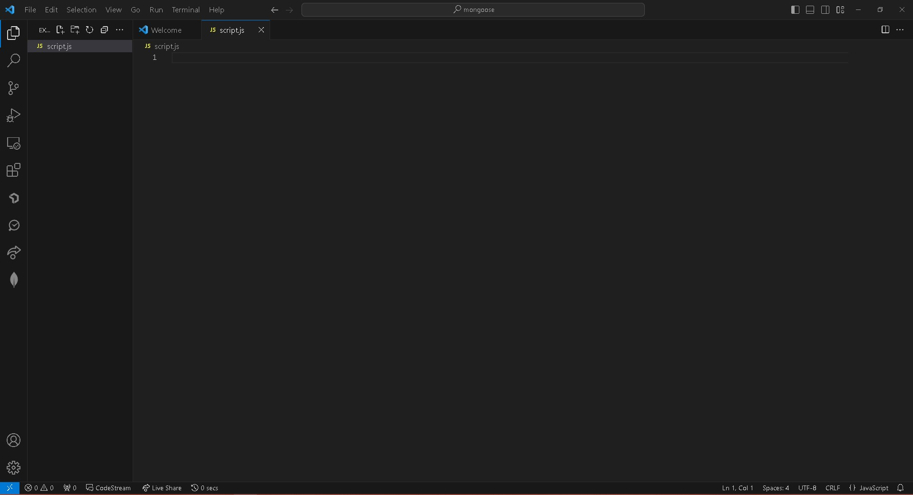
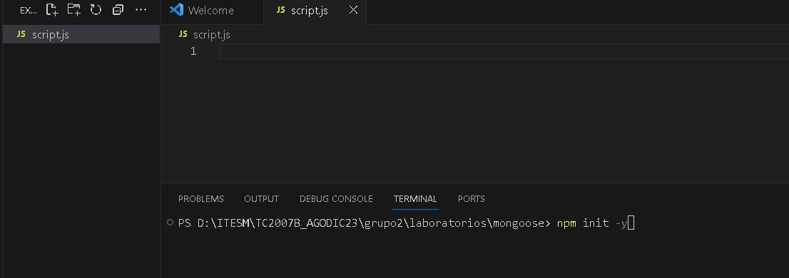
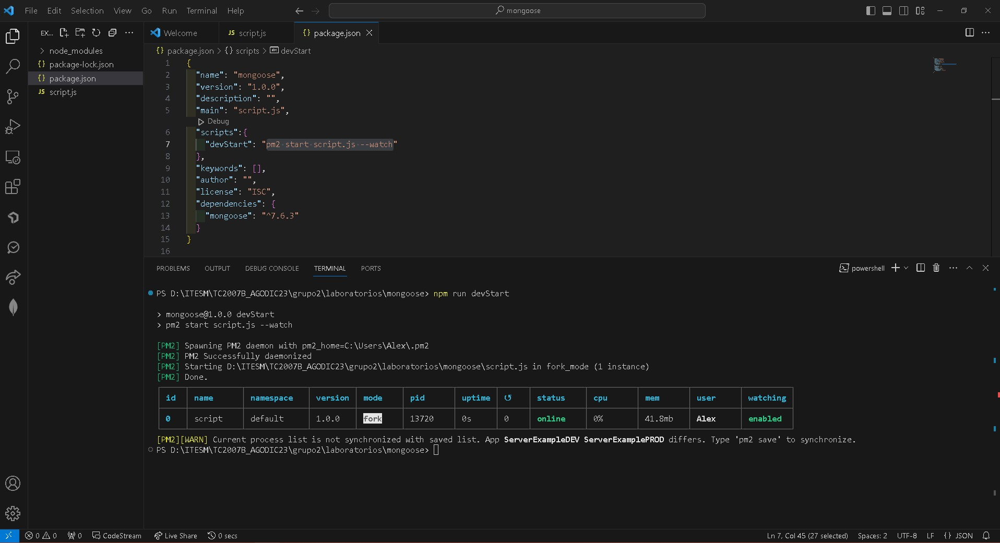
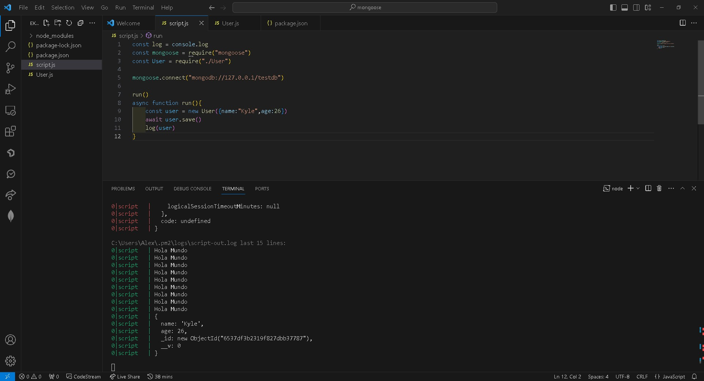
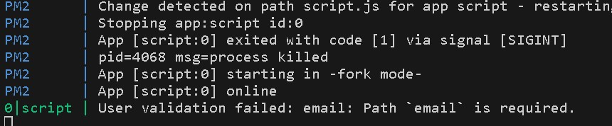

# Mongoose Crash Course

## Objetivo

En este laboratorio aprenderemos lo básico para trabajar con Moongose, una librería que permite conectar una aplicación desarrollada en NodeJS con MongoDB.

Recuerda que desde un punto de vista de seguridad siempre es mejor tener capas intermedias de interconexión con la base de datos en vez de conectarse directamente.

**Nota: Este laboratorio asume que conoces lo básico en desarrollo con NodeJS, uso npm y manejo de Javascript.**

## Instrucciones

Sigue los pasos descritos en la siguiente práctica, si tienes algún problema no olvides que tus profesores están para apoyarte.

## Laboratorio
### Paso 1 Básicos de Mongoose

Para comenzar vamos a iniciar Visual Studio Code y en una carpeta de tu elección vamos a crear un archivo **script.js**. Dentro de la nomenclatura de NodeJS este archivo lo puedes encontrar como **index.js** o **app.js**.



Después vamos a abrir una nueva terminal y vamos a ejecutar el comando:

```
npm init -y
```



**Nota: Recuerda que para poder ejecutar el comando necesitas tener NodeJS instalado, para nuestro caso no importa la versión que tengas debería funcionar.**

Una vez creado el archivo **package.json** vamos a ejecutar el comando:

```
npm i mongoose
```

Por último vamos a agregar una librería global

```
npm i -g pm2
```

PM2 nos permitirá dejar corriendo la aplicación sin la necesidad de estar reiniciando la aplicación, esta librería es recomendada para la puesta en marcha en un servidor, documentación completa puedes encontrarla dentro de la [página oficial](https://pm2.keymetrics.io/).

Ahora vamos a abrir el archivo **package.json** y en la sección de **scripts** vamos a modificar el contenido por lo siguiente:

```
"scripts":{
	"devStart": "pm2 start script.js --watch"
}
```

Con esto podemos ejecutar en terminal el comando y automáticamente nuestro archivo script.js empezará a correr, pero cada vez que lo actualicemos se volverá a ejecutar.

```
npn run devStart
```



**Nota: Si por alguna razón necesitas finalizar, no olvides terminar el proceso, para ello puedes ejecutar el comando:**

```
pm2 kill
```

Para ver mejor que sucede, desde la terminal ejecuta el comando

```
pm2 logs
```

Ahora abre el archivo **script.js** y coloca lo siguiente:

```
console.log("Hola Mundo")
```

Guarda el archivo y observa lo que pasa en la terminal, cada cierto tiempo se ejecuta **script.js**, ese es el trabajo de pm2.

Ahora vamos a mejorar la forma en que realizamos los log, ya que pesa mucho escribir cada vez **console.log**, para ello declaramos lo siguiente:

```
const log = console.log

log("Hola Mundo")
```

Una vez listo nuestro log, ahora sí podemos empezar con Mongoose.

Vamos a declarar la librería debajo de la declaración de log de la siguiente forma:

```
const mongoose = require("mongoose")
```

Y vamos a sustituir nuestro Hola Mundo con la conexión a MongoDB. Recuerda que para este paso debes tener al menos una instancia local de MongoDB en tu computadora, o en su defecto una dirección IP que apunte a la instancia de MongoDB correspondiente.

```
mongoose.connect("mongodb://127.0.0.1/testdb")
```

Si guardamos el archivo no veremos ningún cambio puesto que no nos dice si se realizó correctamente la conexión, por ahora vamos a hacerlo de la manera más básica posible por lo que no nos preocuparemos por validar la conexión.

Dentro de Mongoose existen 3 conceptos importantes que debes saber antes de empezar:

1. Esquema: Es la forma de saber que estructura tiene tu Base de Datos, si bien habíamos mencionado que en MongoDB la estructura es abierta a comparación de las Base de Datos Relacionales, cuando hablamos de la capa de aplicación siempre es mejor tener un esquema definido, para que el equipo pueda trabajar de manera uniforme y no generar conflicto como por ejemplo: (miTabla, mi_tabla).
2. Modelos: Son los objetos que utilizan el esquema para modelar a nivel de código la base de datos.
3. Queries: Son las solicitudes que haces con la sintaxis de MongoDB a la Base de Datos.

De los anteriores el más importante es el **esquema** debido a que marca la unicidad y la estandarización de la base de datos, un buen esquema permite crecer rápidamente una aplicación. Un mal esquema genera una cantidad terrible de defectos tanto en la aplicación base como en todas sus conexiones.

Vamos a crear un esquema creando un nuevo archivo llamado **User.js**, este archivo deberá contener lo siguiente:

```
const mongoose = require("mongoose")

const userSchema = new mongoose.Schema({
    name:String,
    age:Number
})
```

De esta manera definimos el esquema del objeto User, aquí podemos añadir tanta propiedades como necesitemos y en base a ello Mongoose generará los objetos en la Base de Datos.

Por último necesitamos crear el modelo, esto no es más que añadir una línea de código adicional al final del archivo **User.js**

```
module.exports = mongoose.model("User",userSchema)
```

**Nota: Es importante mencionar que el string User que recibe el modelo, es el nombre que tendrá la colección en la Base de Datos.**

Esto es todo lo que necesitamos para empezar a guardar nuestro objeto **User** en la base de datos.

Vamos a regresar a **script.js**, aquí vamos a llamar nuestro modelo y declararlo debajo de la llamada a mongoose.

```
const User = require("./User")
```

Y debajo de la conexión a mongoose vamos a crear un nuevo usuario a través de una función asíncrona.

```
run()
async function run(){
	const user = new User({name:"Kyle",age:26})
	await user.save()
	log(user)
}
```



**Nota: Cada llamada a la base de datos requiere de una operación de lectura y/o escritura, cuando se hace a un servidor externo se agrega una llamada a internet, estas operaciones son las más costosas a nivel de velocidad en cualquier aplicación. Es por eso que cuando trabajamos con la base de datos es necesario definir funciones asíncronas para poder esperar el tiempo que pueda tardar realizar la operación.**

Para nuestro caso si todo se hizo correctamente, entonces tendrás el resultado como la imagen anterior

```
0|script   | {
0|script   |   name: 'Kyle',
0|script   |   age: 26,
0|script   |   _id: new ObjectId("6537df3b2319f827dbb37787"),
0|script   |   __v: 0
0|script   | }
```

También recuerda que el objectId va a variar de acuerdo a tu máquina.

Otra forma de crear un objeto con Mongoose es usar el método create que trae por default el modelo al heredar de Mongoose. Para hacerlo necesitamos hacer lo siguiente

```
const user = await User.create({name:"Kyle",age:26})
user.name = "Sally"
await user.save()
```

Por tanto en nuestro código actual vamos a sustituir con lo siguiente

```
const log = console.log
const mongoose = require("mongoose")
const User = require("./User")

mongoose.connect("mongodb://127.0.0.1/testdb")  

run()
async function run(){
    const user = await User.create({name:"Kyle",age:26})
    user.name = "Sally"
    await user.save()
    //const user = new User({name:"Kyle",age:26})
    //await user.save()
    log(user)
}
```

Esto creará un nuevo objeto en la base de datos y modificará el nombre a "Sally".

```
0|script   | {
0|script   |   name: 'Kyle',
0|script   |   age: 26,
0|script   |   _id: new ObjectId("6537df3b2319f827dbb37787"),
0|script   |   __v: 0
0|script   | }
0|script   | {
0|script   |   name: 'Sally',
0|script   |   age: 26,
0|script   |   _id: new ObjectId("6537e14163ee41d5af79e209"),
0|script   |   __v: 0
0|script   | }
```

### Paso 2 Tipos de Esquemas

Ahora vamos a añadir a nuestro esquema algunos parámetros adicionales. Dentro del archivo **User.js** veremos lo siguiente, **ojo no vayas a guardar el archivo todavía.**

```
const mongoose = require("mongoose")

const userSchema = new mongoose.Schema({
    name:String,
    age:Number,
    email:String,
    createdAt:Date,
    updatedAt:Date,
    bestFriend:mongoose.SchemaTypes.ObjectId,
    hobbies: [String],
    address: {
        street:String,
        city:String
    }
})

module.exports = mongoose.model("User",userSchema)
```

Aquí vamos a retomar un poco lo visto en el laboratorio anterior sobre las diferentes propiedades que podemos definir a un esquema. Los campos de String son bastante directos hablemos de los que son diferentes. 

En el caso de los Date que podemos recibir fechas de Javascript para guardar información. Siempre que manejes fechas te recomiendo el uso de la librería **moment.js** que hace más simple el manejo de fechas en general. Un tip que puede servirte es manejar las fechas como milisegundos para evitar conflictos a menos que utilices varias zonas horarias en cuyo caso es mejor utilizar timestamps en formato String.

También dentro de las fechas observa el uso en el campo createdAt y updatedAt, siempre es bueno a nivel de trazabilidad de un objeto saber cuando se creó y cuando se actualizó, para reportes este dato es muy útil.

En el caso del campo **bestFriend** observa como definimos un apuntador a la misma estructura de **User**, esto quiere decir que en este campo vamos a agregar otro **User** como relación.

Para **hobbies** estamos declarando una lista de String, en caso de poner la lista como **[ ]** quiere decir que la lista puede recibir lo que sea.

Por último el caso de **address**, igual que en nuestro laboratorio anterior, puede recibir un objeto completo para segmentar más información.

Dos campos que no añadimos a este esquema pero pueden ser muy útiles son **active** y **exists** de tipo boolean, con estos podemos hacer manejo de borrado lógico dentro de la base de datos. Esto es muy útil para evitar borrado en cascada que pueda corromper la aplicación. El problema de esta aproximación en base de datos es que al no borrar nada toda la información guardada a la larga ocupará un espacio en la base de datos, dependiendo la aplicación esto puede ser bueno o malo y debe ajustarse a las políticas de negocio que tenga el sistema.

Ahora que ya tenemos nuestro nuevo esquema vamos a regresar a **script.js** y vamos a actualizar nuestro nuevo usuario a lo siguiente

```
const log = console.log
const mongoose = require("mongoose")
const User = require("./User")

mongoose.connect("mongodb://127.0.0.1/testdb")

run()
async function run(){
    const user = await User.create({
        name:"Kyle",
        age:26,
        hobbies: ["Weight Lifting","Bowling"],
        address:{
            street:"Main St"
        },
    })
    await user.save()
    //const user = new User({name:"Kyle",age:26})
    //await user.save()
    log(user)
}
```

Ahora si guardamos todos los archivos y esperamos a que se ejecute nuevamente la configuración. El resultado

```
0|script | {
0|script |   name: 'Kyle',
0|script |   age: 26,
0|script |   hobbies: [ 'Weight Lifting', 'Bowling' ],
0|script |   address: { street: 'Main St' },
0|script |   _id: new ObjectId("6537e5da0b3fe4d15b8f5a13"),
0|script |   __v: 0
0|script | }
```

Ya que vimos como funcionan las propiedades ahora podemos mejorar nuestro esquema empezando con **address**, si bien lo podemos manejar como un objeto adicional, lo ideal sería tratarlo como un esquema diferente. Dentro de **User.js** vamos a definir esto, antes de la definición de userSchema.


```
const addressSchema = new mongoose.Schema({
    street:String,
    city:String
})
```

Y vamos a modificar la propiedad de **userSchema** **address** a lo siguiente

```
address: addressSchema
```

El código final debería quedar de la siguiente manera

```
const mongoose = require("mongoose")

const addressSchema = new mongoose.Schema({
    street:String,
    city:String
})

const userSchema = new mongoose.Schema({
    name:String,
    age:Number,
    email:String,
    createdAt:Date,
    updatedAt:Date,
    bestFriend:mongoose.SchemaTypes.ObjectId,
    hobbies: [String],
    address: addressSchema
})

module.exports = mongoose.model("User",userSchema)
```

Además de segmentar el código, existe otro beneficio importante de hacerlo así, vuelve a guardar y espera que se ejecute el código, la salida debería ser algo como lo siguiente.

```
0|script | {
0|script |   name: 'Kyle',
0|script |   age: 26,
0|script |   hobbies: [ 'Weight Lifting', 'Bowling' ],
0|script |   address: { street: 'Main St', _id: new ObjectId("6537e78d311737282980b496") },
0|script |   _id: new ObjectId("6537e78d311737282980b495"),
0|script |   __v: 0
0|script | }
```

Ahora **address** tiene una ligera diferencia, incluye un **ObjectId**, para algo simple como lo que tenemos quizás no sea muy útil, pero en objetos más complejos es la mejor aproximación a declarar objetos adicionales dentro de la base de datos.

Ahora, cuando trabajamos con la base de datos y con mongoose, pueden aparecer errores, intenta detectar el siguiente que agregaré al código

```
async function run(){
    const user = await User.create({
        name:"Kyle",
        age:"asdf",
        hobbies: ["Weight Lifting","Bowling"],
        address:{
            street:"Main St"
        },
    })
    await user.save()
    //const user = new User({name:"Kyle",age:26})
    //await user.save()
    log(user)
}
```

Cuando tratamos de ejecutar el código como está vamos a obtener una gran cantidad de errores. Una forma de simplificar esto es que cada vez que realizamos una operación en la base de datos nos apoyemos de la estructura **try catch** para capturar y encapsular los errores.

Por tanto el código mejorado sería el siguiente:

```
async function run(){
    try{
        const user = await User.create({
            name:"Kyle",
            age:"asdf",
            hobbies: ["Weight Lifting","Bowling"],
            address:{
                street:"Main St"
            },
        })
        await user.save()
        log(user)
    }catch(e){
        log(e.message)
    }
}
```

Considera siempre utilizar esta estructura de control ya que existen muchas razones por las que una operación puede fallar, desde errores pasados por el programador hasta errores de comunicación con el servidor.

Regresa el valor del Usuario agregado a 26 para evitar que siga marcando error.

**Nota: Espero que ya lo hayas observado pero cada vez que se guarda un usuario no importa que sus campos sean iguales, el objeto se duplica, considera esto ya que también es parte importante del manejo de MongoDB.**

### Paso 3 Validación de Esquemas

En el paso anterior trabajamos en agregar diferentes tipos de parámetros para nuestro esquema, pero en ocasiones algunos parámetros deben ser obligatorios, ahora vamos a ver como podemos bloquear para solicitar parámetros.

Para hacer, por ejemplo, que el **email** sea obligatorio necesitamos modificar lo siguiente en el esquema.

```
email:{
	type: String,
	required:true
}
```

El código de **User.js** quedaría de la siguiente manera

```
const mongoose = require("mongoose")
const addressSchema = new mongoose.Schema({
    street:String,
    city:String
})

const userSchema = new mongoose.Schema({
    name:String,
    age:Number,
    email:{
        type:String,
        required:true
    },
    createdAt:Date,
    updatedAt:Date,
    bestFriend:mongoose.SchemaTypes.ObjectId,
    hobbies: [String],
    address: addressSchema
})
module.exports = mongoose.model("User",userSchema)
```

Al ejecutarse el código de **script.js** lo que sucede es que se hace la validación del **email**.



Actualiza el user en **script.js** para que reciba el correo, algo como lo siguiente

```
const user = await User.create({
            name:"Kyle",
            age:26,
			email:"TEST@test.com"
            hobbies: ["Weight Lifting","Bowling"],
            address:{
                street:"Main St"
            },
        })
```

Esto nos permitirá guardar correctamente el correo

```
0|script | {
0|script |   name: 'Kyle',
0|script |   age: 26,
0|script |   email: 'TEST@test.com',
0|script |   hobbies: [ 'Weight Lifting', 'Bowling' ],
0|script |   address: { street: 'Main St', _id: new ObjectId("653807942c73a7a02b968858") },
0|script |   _id: new ObjectId("653807942c73a7a02b968857"),
0|script |   __v: 0
0|script | }
```

Ahora, el correo que introducimos puede llevar a errores, por lo general un correo electrónico va en minúsculas, otro cambio que podemos hacer es agregar la propiedad **lowercase**, para convertir el valor a minúsculas.

```
email:{
        type:String,
        required:true,
        lowercase:true
    }
```

Al hacer el cambio y que se ejecuta nuevamente el script, observa el resultado del correo y como de manera automática se convierte el parámetro que pasamos.

```
0|script | {
0|script |   name: 'Kyle',
0|script |   age: 26,
0|script |   email: 'test@test.com',
0|script |   hobbies: [ 'Weight Lifting', 'Bowling' ],
0|script |   address: { street: 'Main St', _id: new ObjectId("6538091a606ded91fe69ec95") },
0|script |   _id: new ObjectId("6538091a606ded91fe69ec94"),
0|script |   __v: 0
0|script | }
```

De la misma manera intenta cambiar **lowercase** por **uppercase** y observa el comportamiento, al final deja **lowercase** como valor.

Otro parámetro que podemos modificar su comportamiento es **createdAt**, para usarlo al momento necesitaríamos agregar la fecha a cada elemento al crearlo, esto puede llevar a errores sobre todo si es un campo que queremos generar siempre, para ello podemos hacer la siguiente modificación

```
createdAt:{
        type:Date,
        default:() => Date.now(),
    },
```

Al guardar el resultado de guardado nos debería regresar lo siguiente

```
0|script | {
0|script |   name: 'Kyle',
0|script |   age: 26,
0|script |   email: 'test@test.com',
0|script |   hobbies: [ 'Weight Lifting', 'Bowling' ],
0|script |   address: { street: 'Main St', _id: new ObjectId("65380a70ce144ca8cb9e136e") },
0|script |   _id: new ObjectId("65380a70ce144ca8cb9e136d"),
0|script |   createdAt: 2023-10-24T18:18:24.030Z,
0|script |   __v: 0
0|script | }
```

Pasaría el mismo caso con **updatedAt** así que podemos cambiar el último cambio a esta propiedad también.

Otra cosa que podemos agregar a **updatedAt** es que sea inmutable, es decir, que no se pueda modificar ya que nuevamente este campo no nos serviría si se viera modificado a lo largo del tiempo.

```
createdAt:{
        type:Date,
        immutable:true,
        default:() => Date.now(),
    },
    updatedAt:{
        type:Date,
        default:() => Date.now(),
    },
```

```
0|script | {
0|script |   name: 'Kyle',
0|script |   age: 26,
0|script |   email: 'test@test.com',
0|script |   hobbies: [ 'Weight Lifting', 'Bowling' ],
0|script |   address: { street: 'Main St', _id: new ObjectId("65380b1d8bdb8c8046b10dc6") },
0|script |   _id: new ObjectId("65380b1d8bdb8c8046b10dc5"),
0|script |   createdAt: 2023-10-24T18:21:17.145Z,
0|script |   updatedAt: 2023-10-24T18:21:17.146Z,
0|script |   __v: 0
0|script | }
```

Ahora por tu parte intenta modificar el **createdAt** y observa que sucede al tener la propiedad de inmutable activa.

Otro parámetro que podemos validar es **age** para establecer valores límite.

```
age:{
        type: Number,
        min:1
    }
```

Si modificamos la edad del usuario a algo menor a 1, por ejemplo -26 recibiremos de respuesta lo siguiente

```
0|script | User validation failed: age: Path `age` (-26) is less than minimum allowed value (1).
```

Lo mismo para un máximo, el cambio sería el siguiente

```
age:{
        type: Number,
        min:1,
        max: 100
    }
```

Algo similar para extensión de string puede aplicarse con la propiedad **minLength**, vamos a modificar nuevamente **email** para delimitar un mínimo de 10 caracteres.

```
email:{
        type:String,
        required:true,
        lowercase:true,
        minLength:10
    },
```

Si modificamos el correo a **TEST@m** el resultado sería el siguiente

```
0|script | User validation failed: email: Path `email` (`test@m`) is shorter than the minimum allowed length (10).
```

Hasta ahora hemos visto validaciones en cierto modo específicas, pero en algunos casos puede que requieras crear tus propias validaciones, para ello vamos a pensar que la edad necesita ser un número par. La modificación que debemos realizar es la siguiente:

```
age:{
        type: Number,
        min:1,
        max:100,
        validate: {
            validator: v => v % 2 === 0,
            message: props => `${props.value} is not an even number`,
        }
    },
```

El validator recibe una función con un valor **v** en este caso lo que recibe el parámetro y a partir de ello se ejecuta una función que debe devolver un **true** o **false** para designar si cumple con el requisito o no.

En caso de que falle se maneja el error a través de un **message** que recibe y se puede parametrizar para dar mejor información de por que ocurrió el error.

**Nota: Observa que en el message del validator la comilla usada es diferente a la simple para poder ejecutar el formato de concatenación de string.**

El problema con el validator es que solo se ejecuta en los métodos **create** o **save**, lo cual está bien para lo que hemos hecho, pero eventualmente vas a necesitar actualizar los datos y por tanto extender también las validaciones de ese lado.

El problema con los otros métodos que tiene mongoose para el manejo de las clases es que algunos no están ni siquiera conectados directamente con la base de datos, para ello la recomendación es que siempre encuentres un objeto a través del método **findById()** y después ejecutes el método **save()** para que tus métodos utilicen los validators que hayas creado para ellos.

### Paso 4 Básicos de Queries

Para hacerlo copia el id del último objeto que hayas creado en la base de datos, en mi caso es **65380e5aaf5f417674fa4a11**. Después vamos a borrar el código que tenemos en **script.js** para crear el usuario y lo dejamos de la siguiente manera.

```
async function run(){
    try{
    
    }catch(e){
        log(e.message)
    }
}
```

Dentro del **try** vamos a realizar lo siguiente, **no olvides utilizar tu propio id**:

```
const user = await User.findById("65380e5aaf5f417674fa4a11")
log(user)
```

Ahora en vez de estar creando usuarios acabamos de regresar el último que hayamos creado.

Nuevamente vamos a cambiar el código dentro del **try** a lo siguiente usando el método **find** que como verás es exactamente igual a como se utiliza en **mongosh**.

```
const user = await User.find({ name: "Kyle" })
log(user)
```

Aquí notarás que obtenemos una gran cantidad de datos, dependiendo de cuantas veces hayas guardado el archivo para volverse a ejecutar mientras hemos trabajado en el laboratorio.

Si modificamos el query a algo que no existe como 

```
const user = await User.find({ name: "s" })
log(user)
```

El resultado es una lista vacía.

```
0|script | []
```

**Nota: Por esto es importante entender como funcionan los queries básicos de MongoDB, esto permitirá que tu experiencia sea más sencilla al momento de hacerlo directamente sobre la aplicación**.

Lo mismo sucederá si modificamos el **find()** por el **findOne()**

```
const user = await User.findOne({ name: "Kyle" })
log(user)
```

Si recuerdas lo que te había mencionado antes es que en el caso de **find()** se devuelve una lista, si no hay resultados esta es vacía, en el caso de **findOne()** es un objeto, pero si no lo encuentra el resultado es **null**. Este es el comportamiento más básico de queries en general.

```
const user = await User.findOne({ name: "s" })
log(user)
```

```
0|script | null
```

Para algunas personas el uso de la sintaxis de MongoDB es complicado sobre todo para queries complejos, es por esto que Mongoose introduce una forma de visualizar más fácilmente los queries.

Vamos a pensar que queremos generar el query

```
const user = await User.find({ name: "Kyle" })
log(user)
```

La forma de hacerlo, usando la librería de queries de Mongoose sería la siguiente

```
const user = await User.where("name").equals("Kyle")
log(user)
```

Lo mismo podemos hacer con buscar todos los objetos que tengan un **age** mayor a 12

```
const user = await User.where("age").gt(12)
log(user)
```

Para realizar queries compuestos podríamos hacer lo siguiente

```
const user = await User
.where("age").gt(12)
.where("name").equals("Kyle")

log(user)
```

**Nota: No olvide que al trabajar con queries compuestos, estás realizando operaciones AND, por lo que en cada pasada se va filtrando información del resultado final**

También podemos aplicar el **limit** para reducir la cantidad de resultados

```
const user = await User
.where("age").gt(12)
.where("name").equals("Kyle")
.limit(2)

log(user)
```

También podemos limitar los campos que regresamos por ejemplo

```
const user = await User
.where("age").gt(12)
.where("name").equals("Kyle")
.limit(2)
.select("age")

log(user)
```

El resultado es como lo esperamos

```
0|script | [
0|script |   { _id: new ObjectId("6537df3b2319f827dbb37787"), age: 26 },
0|script |   { _id: new ObjectId("6537e5da0b3fe4d15b8f5a13"), age: 26 }
0|script | ]
```

Para lo siguiente voy a tomar el último id del resultado anterior **6537e5da0b3fe4d15b8f5a13**, reserva el tuyo también.

Primero vamos a ir al esquema de **User** nuevamente y vamos a buscar la propiedad de **bestFriend**, como lo hicimos con las validaciones anteriores vamos a modificar esta propiedad con lo siguiente.

```
bestFriend:{
	type: mongoose.SchemaTypes.ObjectId,
	ref: "User"
},
```

Aquí la modificación es a través de **ref**, esto le dice al esquema de que tipo de objeto estamos esperando, en este caso es sí mismo **User**, pero con esto ya podemos asignar un objeto a otro. Ahora en **script.js** nuevamente en el **try** vamos a tener lo siguiente.

```
const user = await User
        .where("age").gt(12)
        .where("name").equals("Kyle")
        .limit(1)
        .select("age")

        user[0].bestFriend = "6537e5da0b3fe4d15b8f5a13"

        await user[0].save()

        log(user)
```

Si guardamos, al ejecutarse el script, el resultado sería lo siguiente

```
0|script | [
0|script |   {
0|script |     _id: new ObjectId("6537df3b2319f827dbb37787"),
0|script |     age: 26,
0|script |     bestFriend: new ObjectId("6537e5da0b3fe4d15b8f5a13")
0|script |   }
0|script | ]
```

Ahora podemos modificar el query a algo más interesante como lo siguiente

```
const user = await User
        .where("age").gt(12)
        .where("name").equals("Kyle")
        .populate("bestFriend")
        .limit(1)
        .select("age")

        log(user)
```

La función **populate** nos permite llenar el objeto resultado. Si guardas el script el resultado será el siguiente

```
0|script | [
0|script |   {
0|script |     _id: new ObjectId("6537df3b2319f827dbb37787"),
0|script |     age: 26,
0|script |     bestFriend: {
0|script |       _id: new ObjectId("6537e5da0b3fe4d15b8f5a13"),
0|script |       name: 'Kyle',
0|script |       age: 26,
0|script |       hobbies: [Array],
0|script |       address: [Object],
0|script |       __v: 0,
0|script |       updatedAt: 2023-10-24T19:12:34.371Z
0|script |     }
0|script |   }
0|script | ]
```

Ahora **bestfriend** nos devuelve como resultado todo el objeto **User**. Es importante que sepas que MongoDB no hace JOINS como SQL, es más los JOIN tienen dificultades, pero esta es la forma de obtener la información del objeto sin necesariamente hacer JOINS. El resultado final es el mismo pero la forma de hacerlo es diferente.

### Paso 5 Métodos y Esquemas Virtuales

Hasta ahora lo que hemos visto cubre lo más básico de Mongoose, pero si queremos mejorar enormemente nuestro código, los siguientes pasos nos harán una diferencia abismal.

Para empezar vamos a modificar el **script.js** dentro de nuestro **try** para dejar un query básico.

```
const user = await User.findOne({ name: "Kyle" })
log(user)
```

Ahora vamos a nuestro **User.js**, en este caso vas a ver que podemos agregar funciones específicas para cada uno de nuestros objetos User.

En la parte de hasta abajo, previo a realizar el **module.exports** vamos a agregar lo siguiente

```
userSchema.methods.sayHi = function(){
    console.log(`Hi. My name is ${this.name}`)
}
```

Ahora si regresamos a **script.js** justo debajo de **log(user)** podemos llamar a

```
user.sayHi()
```

Al ejecutarse el resultado será el siguiente

```
0|script | {
0|script |   hobbies: [],
0|script |   _id: new ObjectId("6537df3b2319f827dbb37787"),
0|script |   name: 'Kyle',
0|script |   age: 26,
0|script |   __v: 0,
0|script |   bestFriend: new ObjectId("6537e5da0b3fe4d15b8f5a13"),
0|script |   updatedAt: 2023-10-24T19:21:47.483Z
0|script | }
0|script | Hi. My name is Kyle
```

La ventaja de hacer esto es que puedes definir métodos para tus modelos dentro del esquema para organizar mejor el objeto y sobre todo el comportamiento que tienen los usuarios.

Con lo que hicimos modificamos los métodos del objeto **User**, pero también podemos modificar los estáticos, esto nos permitirá acceso a los métodos que existen dentro de la clase.

Por ejemplo, debajo de **sayHi**, vamos a realizar lo siguiente

```
userSchema.statics.findByName = function(name){
    return this.where({name: new RefExp(name, "i")})
}
```

Si modificamos nuestro query quedaría algo como lo siguiente

```
const user = await User.findByName("Kyle")
log(user)
user.sayHi()
```

Este query ejecuta un where a través de una expresión regular para ignorar como vengan los caracteres. Una vez regresamos el objeto el resultado en la terminal serán todos los objetos que tienen el nombre **Kyle**, observa que la sintaxis del **where** es diferente a como la teníamos hace unos ejemplos anteriores, pero esto es por que esencialmente el **where** es igual al **find**.

**Nota: sayHi() no funciona ya que estamos sobre una lista y no sobre el objeto User**

Los anteriores modifican directamente a **User**, pero que pasa si queremos modificar algo relacionado a un query. Para ello haríamos lo siguiente

```
userSchema.statics.findByName = function(name){
    return this.find({name: new RegExp(name, "i")})
}

userSchema.query.byName = function(name){
    return this.where({name: new RegExp(name, "i")})
}
```

Vamos a modificar el anterior para dejarlo más estandarizado y agregar la modificación a **userSchema.query...**

El cambio dentro del query sería el siguiente

```
const user = await User.find().byName("Kyle")
log(user)
user.sayHi()
```

Ahora con el cambio primero buscamos y luego hacemos el filtro. Pero si intentamos hacer lo siguiente

```
const user = await User.byName("Kyle")
```

Vamos a obtener un error, y es por que para llamar **byName** es necesario llamar primero un query.

Realmente no hay diferencia con los últimos dos, depende de ti donde quieras colocar la función, si en **statics** o en **query**.

Por último veremos los **virtual**, su definición será un poco diferente, pero nuevamente vamos a colocarlo debajo de 

```
userSchema.query.byName = function(name){
    return this.where({name: new RegExp(name, "i")})
}
```

Lo que vamos a definir es lo siguiente

```
userSchema.virtual("namedEmail").get(function(){
    return `${this.name} <${this.email}>`
})
```

Al hacer esto estamos definiendo una especie de etiqueta o propiedad nueva que no se guarda en la base de datos, pero que se llama al momento de obtener un usuario.

Para probarlo vamos a nuestro **script.js** y dentro del **try** vamos a modificar nuestro query a lo siguiente.

```
const user = await User.findOne({ name:"Kyle"})
log(user)
log(user.namedEmail)
```

Para llamar la propiedad observa que es como si llamaramos un parámetro normal. Pero el resultado es el siguiente

```
0|script | {
0|script |   hobbies: [],
0|script |   _id: new ObjectId("6537df3b2319f827dbb37787"),
0|script |   name: 'Kyle',
0|script |   age: 26,
0|script |   __v: 0,
0|script |   bestFriend: new ObjectId("6537e5da0b3fe4d15b8f5a13"),
0|script |   updatedAt: 2023-10-24T19:46:23.714Z
0|script | }
0|script | Kyle <undefined>
```

La propiedad no existe en el objeto, pero cuando la llamamos nos otorga el resultado como lo definimos en la función. Ahora bien este resultado particular nos regresa undefined debido a que no tiene correo, por tanto busquemos un usuario que si tenga correo.

```
const user = await User.findOne({ name:"Kyle", email:"test@test.com"})
log(user)
log(user.namedEmail)
```

El resultado nuevamente

```
0|script | {
0|script |   _id: new ObjectId("6538091a606ded91fe69ec94"),
0|script |   name: 'Kyle',
0|script |   age: 26,
0|script |   email: 'test@test.com',
0|script |   hobbies: [ 'Weight Lifting', 'Bowling' ],
0|script |   address: { street: 'Main St', _id: new ObjectId("6538091a606ded91fe69ec95") },
0|script |   __v: 0,
0|script |   updatedAt: 2023-10-24T19:48:29.715Z
0|script | }
0|script | Kyle <test@test.com>
```

### Paso 6 Esquemas de Middleware

Probablemente estás familiarizado con los middleware y con Express, Mongoose nos permite trabajar con ello para salvar, actualizar o remover código de la base de datos de una manera fácil.

Dentro de nuestro **User.js** después de nuestro método virtual vamos a agregar lo siguiente

```
userSchema.pre("save", function(next){
    this.updatedAt = Date.now()
    next()
})
```

Y más allá del middleware espero que te haga sentido, pues **updateAt** a diferencia de **createdAt** necesita actualizarse cada vez que se genere un cambio en el objeto.

El uso de la sintaxis **pre** nos dice que esto se debe ejecutar antes de la instrucción a ejecutar, en nuestro caso **save**, también tenemos el caso de **post** que en su caso se ejecuta después de la modificación del objeto.

**Nota : Por si no recuerdas el método next() sirve para avanzar un middleware al siguiente flujo.**

Para hacer une prueba vamos a actualizar el **try** de **script.js** a los siguiente.

```
const user = await User.findOne({ name:"Kyle", email:"test@test.com"})
log(user)
await user.save()
log(user)
```

Al ejecutarse observa el cambio en **updatedAt**, aunque sea cuestión de milisegundos debería verse un cambio.

Para hacer un cambio usando el **post** podemos intentar lo siguiente debajo del  **pre**

```
userSchema.post("save", function(doc,next){
    doc.sayHi()
    next()
})
```

El resultado debería verse como lo siguiente

```
0|script | {
0|script |   _id: new ObjectId("6538091a606ded91fe69ec94"),
0|script |   name: 'Kyle',
0|script |   age: 26,
0|script |   email: 'test@test.com',
0|script |   hobbies: [ 'Weight Lifting', 'Bowling' ],
0|script |   address: { street: 'Main St', _id: new ObjectId("6538091a606ded91fe69ec95") },
0|script |   __v: 0,
0|script |   updatedAt: 2023-10-24T20:00:23.396Z
0|script | }
0|script | Hi. My name is Kyle
0|script | {
0|script |   _id: new ObjectId("6538091a606ded91fe69ec94"),
0|script |   name: 'Kyle',
0|script |   age: 26,
0|script |   email: 'test@test.com',
0|script |   hobbies: [ 'Weight Lifting', 'Bowling' ],
0|script |   address: { street: 'Main St', _id: new ObjectId("6538091a606ded91fe69ec95") },
0|script |   __v: 0,
0|script |   updatedAt: 2023-10-24T20:00:33.628Z
0|script | }
```

Esto cubre los aspectos fundamentales de Mongoose, cualquier detalle adicional como métodos adicionales sobre validaciones, puntos más particulares sobre los esquemas puedes encontrarlos en la [documentación oficial](https://mongoosejs.com/docs/), recuerda que lo más importante es practicar para entender rápidamente el funcionamiento de la librería.

